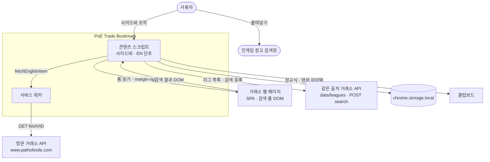
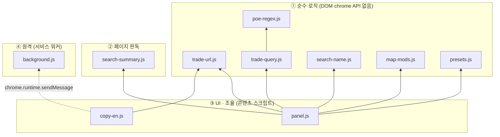
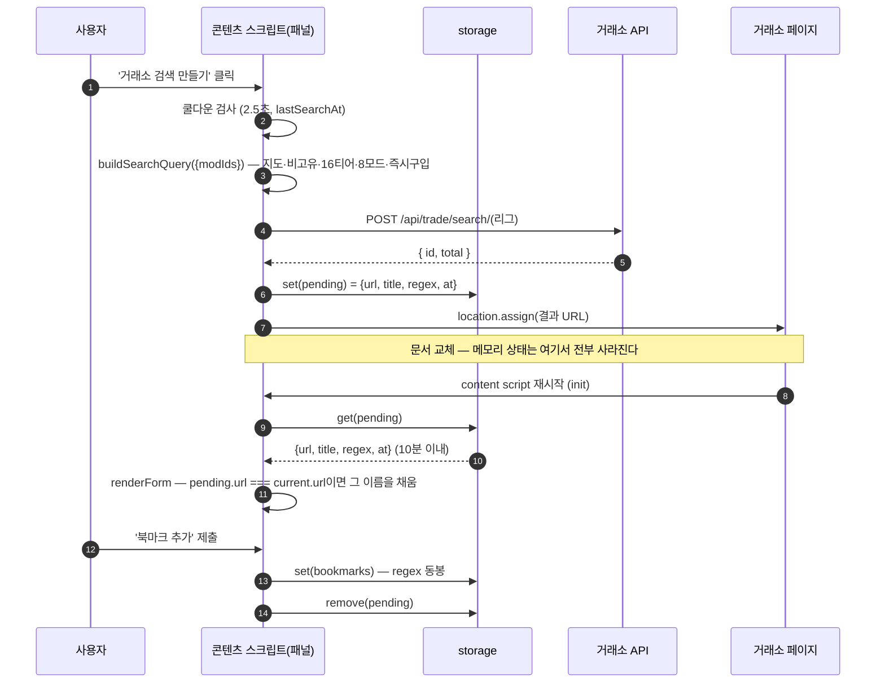

# 설계 문서 (PoE Trade Bookmark)

[요구사항 명세](REQUIREMENT.md)가 **무엇을 해야 하는가**를 정한다면, 이 문서는 **어떻게 그렇게 하는가**를 정합니다. 요구사항은 사용자에게 보이는 동작을
`FR-…`/`NFR-…` ID로 못 박고, 설계는 그 ID를 어느 파일의 어느 수단으로 지키는지 적습니다. 그래서 이 문서의 서술에는 거의 언제나 요구사항 ID와 코드 위치가
함께 붙습니다. 대상은 `v0.6.0`이고, 코드와 어긋나는 곳이 있으면 그것은 문서의 결함입니다.

**목차** — [1 설계 방법론](#1-설계-방법론) · [2 시스템 맥락](#2-시스템-맥락-c4-level-1) · [3 실행
컨테이너](#3-실행-컨테이너-c4-level-2) · [4 컴포넌트 구조](#4-컴포넌트-구조-c4-level-3) · [5 주요 흐름](#5-주요-흐름) · [6 상태·데이터
설계](#6-상태데이터-설계) · [7 품질 속성 설계](#7-품질-속성-설계) · [8 검증 설계](#8-검증-설계) · [9 확장 지점과 알려진
부채](#9-확장-지점과-알려진-부채) · [10 리그 교체 대응](#10-리그-교체-대응) · [11 상세 문서](#11-상세-문서) · [확인이 필요한
자리](#확인이-필요한-자리)

---

## 1. 설계 방법론

### 1.1 이 규모에 맞는 것만

소스 12개 파일 3,720줄(테스트 3개와 `manifest.json`을 더하면 16개 4,598줄), 빌드 단계 없음, 의존성 없음, 개발자 한 명. 이 규모에서 설계 문서가
실패하는 방식은 둘입니다 — **너무 두꺼워 아무도 안 읽거나**, 코드와 따로 놀아 **거짓말이 되거나.** 그래서 무거운 방법론 대신 네 가지만 씁니다.

| 도구 | 무엇에 쓰나 | 왜 이것인가 |
| --- | --- | --- |
| **경량 C4** (맥락 → 컨테이너 → 컴포넌트) | §2~§4. 위에서 아래로 세 번 확대한다 | 그림 세 장으로 전체가 들어오고, 층마다 독자가 다르다 |
| **ADR** (설계 결정 기록) | [design/adr.md](design/adr.md). 되돌리기 어려운 결정만 | 이 프로젝트의 값진 정보는 구조가 아니라 **왜 그 구조인가**에 있다 |
| **시퀀스** | §5. 시간이 지나며 벌어지는 일 | 페이지 재시작을 가로지르는 흐름은 정적 구조로 안 보인다 |
| **모듈 상세** | [§11의 세 편](#11-상세-문서). 코드 레벨 | 상위 문서를 얇게 유지하기 위해 아래로 밀어낸다 |

쓰지 않기로 한 것: 클래스 다이어그램(클래스가 없습니다), 배포 다이어그램(배포가 없습니다 — 압축 해제 로드), 계층별 인터페이스 명세(전역 함수 몇 개가 전부입니다).

### 1.2 이 설계를 관통하는 세 가지 제약

설계 판단의 대부분은 아래 셋에서 따라 나옵니다. 개별 결정이 이해되지 않을 때는 어느 제약에서 나온 것인지 먼저 보세요.

1. **조건은 서버에 있고 화면에만 남는다.** 거래소는 검색 조건을 주소에 담지 않고 URL
파라미터로 받지도 않습니다. 조건을 알려면 **폼을 읽는** 수밖에 없고, 검색을 만들려면 **API에 등록**하는 수밖에 없습니다.
2. **페이지를 옮기면 확장도 통째로 다시 시작한다.** 콘텐츠 스크립트에는 이어지는 수명이
없습니다. 이동을 가로질러야 하는 것은 전부 저장소에 맡기고 유효기간을 붙입니다.
3. **남의 페이지에 얹혀산다.** 거래소의 DOM·CSS·단축키·요청 한도는 우리 것이 아닙니다.
의존은 한곳에 모으고, 흔적은 최소로 남기고, 요청은 아껴 씁니다.

### 1.3 문서와 코드가 어긋나지 않게 하는 방법

- 모든 서술은 **코드에서 확인된 것**만 담고, 필요한 곳에 `panel.js:417` 형태로 근거
위치를 답니다. 구현이 요구사항을 못 따라가는 자리는 감추지 않고 [§9.3](#93-요구사항과의-어긋남)에 모읍니다.
- 요구사항 ID를 그대로 인용해 **요구사항 → 설계 → 코드**가 한 줄로 이어지게 합니다.
- 수치(TTL, 쿨다운, 재시도, 한도)는 풀어 쓰지 않고 **코드의 상수 이름과 함께** 적습니다.
값이 바뀌면 문서가 아니라 상수가 바뀌어야 합니다.
- 이 문서의 외부 링크(GGG 포럼, poedb, poe.re)는 **코드 주석에 적힌 출처를 옮긴 것**이고
이 문서가 새로 조사한 것이 아닙니다.

---

## 2. 시스템 맥락 (C4 Level 1)

확장은 독립된 프로그램이 아니라 **거래소 페이지 안에 얹혀 도는 코드**입니다. 맥락에서 중요한 것은 기능이 아니라 경계 — 어디부터가 우리가 못 고치는 남의 것인가입니다.



| 경계 | 오가는 것 | 신뢰·권한 |
| --- | --- | --- |
| 사용자 ↔ 콘텐츠 스크립트 | 이름 입력, 모드 선택, 정규식 붙여넣기 | 붙여넣은 정규식은 **믿을 수 없는 입력**이다. JS `RegExp`를 안 쓰는 이유는 둘로 나뉜다 — 게임에 없는 문법까지 통과시키지 않기 위한 **충실도**(ADR-008, `trade-query.js:98-101`)와, 되추적 폭발에 사이드바가 멈추지 않기 위한 **ReDoS 회피**(ADR-009, FR-REGEX-08) |
| 콘텐츠 스크립트 ↔ 거래소 페이지 | 읽기: 검색 폼(`.search-panel`, `search-summary.js:22`)과 결과 줄(`.results .row[data-id]`, `copy-en.js:15`). 쓰기: `<html>`의 `margin-right`(`panel.js:219`), 결과 줄이 `static`일 때만 세우는 `position: relative`(`copy-en.js:150`), EN 단추 | 같은 출처·같은 문서지만 **격리된 실행 세계**다. 페이지 JS 변수는 못 보고 DOM만 본다. 사이드바는 Shadow DOM(`panel.js:158`)으로 CSS를 서로 끊는다 |
| 콘텐츠 스크립트 ↔ 같은 출처 API | `GET /api/trade/data/leagues`(`panel.js:895`), `POST /api/trade/search/<리그>`(`panel.js:923`). 둘 다 `credentials: 'include'` | 페이지와 같은 origin이라 **추가 권한이 필요 없다**(NFR-SEC-04). 로그인 쿠키는 브라우저가 알아서 실어 보내고 확장은 읽지 않는다 |
| 서비스 워커 ↔ 영문 거래소 | `GET /api/trade/fetch/<아이템ID>` → `extended.text`(base64 UTF-8) | 다른 출처다. `host_permissions: https://www.pathofexile.com/*` 하나로만 열려 있고 `credentials: 'omit'`(`background.js:39`)이라 계정과 무관하게 나간다 |
| ↔ `chrome.storage.local` | 북마크·기록·프리셋·빌더 상태·TTL 표식(→ §6) | 확장 전용 저장소다. 페이지는 접근할 수 없고, 확장을 지우면 함께 사라진다. 동기화·외부 전송 없음(NFR-SEC-03) |
| ↔ 클립보드 | 인게임 정규식 문자열, 영문 아이템 전문 | 사용자 제스처 안에서만 쓴다. **EN 복사에 한해** 거부되면 `textarea` + `execCommand`로 한 번 더 시도한다(`copy-en.js:68`의 `copyText`, FR-EN-09). 사이드바의 복사 두 곳에는 이 폴백이 없다(→ §9.3) |
| 사용자 ↔ 인게임 검색창 | 정규식 문자열 (사람 손을 거쳐 나감) | 확장과 게임 사이에 **연결이 없다.** 게임이 어떻게 매칭하는지 확인할 길이 없으므로 엔진 동작을 코드로 재현해 맞추는 수밖에 없다(FR-REGEX-05·06) |

### 외부 제약 (확장이 통제하지 못하는 것)

| 제약 | 내용 | 설계에 남긴 흔적 |
| --- | --- | --- |
| 거래소 DOM 구조 | 조건은 주소에 없고 폼에만 있어 마크업을 읽어야 한다. GGG가 언제든 바꾼다 | 마크업을 아는 파일을 둘로 한정하고(NFR-ROB-01), 못 읽으면 검색 ID 이름으로 물러선다 |
| 거래소가 URL 파라미터를 안 받음 | 조건을 주소로 전달할 방법이 없다 | 빌더는 `POST search`로 등록해 받은 id로 이동한다(FR-BUILD-02) |
| API 요청 한도 | 검색 등록·아이템 조회 모두 IP/계정 기준 한도가 있다 | `SEARCH_COOLDOWN_MS` 2.5초(`panel.js:723`), 리그 24시간 캐시, 아이템 캐시, `Retry-After` 그대로 안내 |
| 게임 정규식 엔진 | MSVC `std::regex` 기반이고 후방 탐색·역참조가 없다. 확인할 API가 없다 | `poe-regex.js`가 문법과 매칭을 직접 구현한다 |
| 리그별 모드 풀 | 리그가 바뀌면 모드·stat id가 달라진다 | `map-mods.js` 한 파일과 `test/fixtures/`로 격리 (→ §10) |

---

## 3. 실행 컨테이너 (C4 Level 2)

확장은 네 덩어리로 돕니다. 무엇이 어디서 도는지가 곧 **무슨 권한으로 무엇을 할 수 있는지**입니다.

| 컨테이너 | 실행 위치 | 수명 | 바깥과 말하는 법 |
| --- | --- | --- | --- |
| 콘텐츠 스크립트 묶음 (9개 파일) | 거래소 탭 안, 격리된 세계 | **문서 하나만큼.** 페이지를 옮기면 통째로 다시 시작한다 | 같은 출처 `fetch`, `chrome.storage.local`, `chrome.runtime.sendMessage` |
| 서비스 워커 (`background.js`) | 확장 프로세스 | 이벤트마다 깨어났다 잠든다. 상태를 들고 있지 않는다 | `chrome.runtime.onMessage`(`background.js:79`)로 받고 `sendResponse`로 답한다 |
| Shadow DOM UI (`panel.css`) | 콘텐츠 스크립트가 만든 호스트 요소 안 | 콘텐츠 스크립트와 같다 | 페이지와 DOM·CSS가 끊겨 있다. 키 이벤트도 호스트에서 끊는다(`panel.js:189`) |
| `chrome.storage.local` | 브라우저 | 확장을 지울 때까지 | `get`/`set`, 다른 탭에 알리는 `storage.onChanged`(`panel.js:696`) |

**EN 조회만 서비스 워커인 이유.** 영문 텍스트는 `www.pathofexile.com`에서 와야 하는데 한국 서버 페이지에서 보면 다른 출처이고, 거래소 API는 CORS
헤더를 주지 않아 페이지 안에서는 요청 자체가 막힙니다. `host_permissions`를 가진 쪽이 대신 보내야 하고 그 자리가 서비스 워커입니다(`background.js`
머리주석). 콘텐츠 스크립트는 아이템 ID만 넘기고(`copy-en.js:46`) 결과를 받습니다.

**나머지가 콘텐츠 스크립트인 이유.** 리그 목록과 검색 등록은 페이지와 **같은 출처**라 추가 권한 없이 나갑니다(`panel.js:895`, `:923`). 더 중요한 건
조건 읽기입니다 — 조건은 검색 ID에 묶여 있고 화면에는 폼으로만 남으므로, 페이지 DOM에 닿는 쪽이 아니면 **요청을 보내지 않고는** 읽을 수 없습니다. 요청을 보내지 않는
것이 요구사항(NFR-API-03)이라 이 일은 페이지 안에 있어야 합니다.

**크롬 사이드 패널 API가 아니라 페이지 내 사이드바인 이유.** ① 사이드 패널은 페이지 DOM에 닿지 못해 위의 폼 읽기를 못 합니다. ② 거래소를 덮지 않고 밀어내야
하는데(FR-PANEL-03) 문서를 미는 일은 문서 안에서만 됩니다(`panel.js:219`). ③ 목록을 눌렀을 때 **보고 있던 그 탭**이 이동해야 합니다(`:292`).
대가로 CSS·단축키 충돌을 떠안고 그것을 Shadow DOM과 이벤트 차단으로 막습니다(→ §7.3). 스타일도 코드로 만든 `CSSStyleSheet`로 넣어 거래소 CSP를
피하고, 못 읽어도 기능은 계속 갑니다(`:175`).

### 이 설계의 핵심 제약: 이동하면 다 날아간다

거래소는 SPA지만 사이드바에서 검색으로 이동할 때는 `location.assign`으로 **문서를 새로 로드**합니다(`panel.js:292`, `:955`). 그러면 콘텐츠
스크립트의 변수가 전부 사라지므로, 이동을 건너야 하는 상태는 메모리가 아니라 저장소에 맡기고 남아 썩지 않도록 TTL을 붙입니다.

| 걸쳐야 하는 것 | 어디에 | 수명 | 근거 |
| --- | --- | --- | --- |
| 사이드바에서 이동했다는 표식 (기록에 안 남기려고) | `nav` | 60초, 1회용, 주소가 맞을 때만 소비 | `NAV_TTL_MS`(`panel.js:374`), `takePanelNav` |
| 빌더가 방금 만든 검색의 이름·정규식 | `pending` | 10분 | `PENDING_TTL_MS`(`panel.js:726`), `savePending`/`loadPending` |
| 사이드바·기록 절 펼침 상태 | `panelOpen` / `historyOpen` | 무기한 | `panel.js:236`, `:472` |
| 리그 목록 | `leagues` | origin별 24시간 | `panel.js:888-899` |

주소만 바뀌는 SPA 이동은 문서가 살아 있어 반대로 **다시 시작하지 않습니다.** 그건 `popstate`/`hashchange`와 0.5초 폴링이 잡아
냅니다(`panel.js:688-693`). → §5

---

## 4. 컴포넌트 구조 (C4 Level 3)

12개 소스 파일은 **크롬·DOM에 얼마나 묶여 있는가**로 네 층으로 갈립니다. 아래 층일수록 브라우저 없이 돌릴 수 있고, 위층일수록 바깥 사정에 따라 자주 바뀝니다.



화살표는 실제 전역 참조를 확인한 것입니다. `map-mods.js`와 `presets.js`는 아무것도 참조하지 않는 데이터이고(프리셋의 `keys`는 맵모드 id 문자열이지만
**코드 의존은 아닙니다**), `search-summary.js`·`search-name.js`·`poe-regex.js`도 서로를 부르지 않습니다. **층을 건너뛰는 화살표는
없고, 프로세스를 넘는 점선 하나가 위로 갑니다** — `copy-en.js` → `background.js` 메시지입니다.

`MOD_GROUPS`(`map-mods.js:108`)는 정의·export만 있고 저장소 어디서도 읽지 않습니다. 목록의 계열 제목은 각 모드의 `group` 문자열이 바뀌는
지점에서 붙습니다(`panel.js:810`) — 즉 **`group`은 표시용 문자열이고 코드가 그 값을 검사하지 않습니다.** 같은 계열은 `MAP_MODS` 배열에서 연속으로
두어야 제목이 한 번만 붙습니다.

### 모듈 시스템이 없는 이유와 로드 순서

번들러도 `import`도 쓰지 않습니다. 빌드 단계 없이 압축 해제한 채로 로드하는 것이 요구사항(NFR-DEV-05)이고, 그러면 파일을 잇는 수단은 **로드 순서와 공유
전역**뿐입니다 — 콘텐츠 스크립트는 같은 스코프를 나눠 써서 먼저 로드된 파일의 최상위 선언이 뒤 파일에 그대로 보입니다. `manifest.json:28-38`의 `js`
배열이 곧 의존 순서입니다: `trade-url` → `search-summary` → `search-name` → `poe-regex` → `map-mods` →
`presets` → `trade-query` → `panel` → `copy-en`. 대부분의 참조는 호출 시점이라 여유가 있지만 두 곳은 **로드 시점에 이미 필요**합니다 —
`trade-query.js:47`의 `const REGEX_MAX = POE_QUERY_MAX;`(`poe-regex.js`가 먼저)와 `copy-en.js:183`의
`sweep()`가 곧바로 부르는 `parseTradeUrl`(`trade-url.js`가 먼저).

브라우저에서는 순서를 매니페스트가 깔아 주지만 테스트에는 매니페스트가 없어 테스트가 그 일을 대신합니다 — `test/trade-query.test.js`는
`Object.assign(globalThis, require('../poe-regex.js'))`로 아래층 전역을 먼저 깔고 `map-mods`를 얹은 뒤
`trade-query.js`를 부릅니다. `test/search-summary.test.js`도 같은 방식입니다. 각 파일 끝의 `if (typeof module !==
'undefined') module.exports = …`가 두 세계를 동시에 만족시키는 장치입니다. **파일을 추가하면 `manifest.json`의 `js`에도 순서에 맞게
넣어야 합니다**(NFR-DEV-02). 이 사슬의 설명은 이 절에만 두고 §9.1과 ADR-002는 여기를 참조합니다.

### 컴포넌트별 책임

| 층 | 파일 | 한 줄 책임 | 요구사항 |
| --- | --- | --- | --- |
| ① | `trade-url.js` | 거래소 URL을 `{mode, league, searchId, url}`로 파싱하고 쿼리·해시를 버려 정규화한다 | FR-BM-01, FR-SPA-03, NFR-SEC-05 |
| ① | `poe-regex.js` | 인게임 검색창 문법을 해석하고 NFA로 매칭한다. JS `RegExp`를 쓰지 않는다 | FR-REGEX-05·06·07·08, NFR-ROB-04 |
| ① | `trade-query.js` | 8모드 검색 쿼리 JSON과 인게임 정규식을 만들고, 정규식에서 모드를 역복원한다 | FR-BUILD-01·03·04·05, FR-REGEX-01·02·03·04·09 |
| ① | `search-name.js` | 읽어 낸 조건 구조를 80자 이름 한 줄로 줄인다 | FR-SUM-06 |
| ① | `map-mods.js` | T16 지도 모드 80개의 stat id·정규식 키워드·문구 데이터 | FR-DATA-01·02 |
| ① | `presets.js` | 기본 프리셋 정의(모드 식별자 목록과 선택 근거 주석) | FR-PRESET-01·05 |
| ② | `search-summary.js` | 거래소 검색 폼 DOM에서 조건을 구조로 뽑고 툴팁 문구로 편다 | FR-SUM-01~05, NFR-ROB-01·02 |
| ③ | `panel.js` | 사이드바를 심고 북마크·기록·빌더·프리셋·모드 창을 조율한다 | FR-PANEL 전부, FR-BM, FR-HIST, FR-BUILD, FR-MODAL, FR-PRESET |
| ③ | `copy-en.js` | 결과 줄에 EN 단추를 붙이고 받은 영문 텍스트를 클립보드에 넣는다 | FR-EN-01·05·06·07·09·10·11 |
| ③ | `panel.css` | Shadow DOM 안에서만 적용되는 사이드바 스타일 | FR-PANEL-07·09, FR-MODAL-01·04 |
| ③ | `copy-en.css` | 거래소 DOM에 직접 주입되는 EN 단추 스타일 (`.results [data-id]` 한정) | FR-EN-01, NFR-ROB-05 |
| ④ | `background.js` | 영문 거래소에 아이템을 물어 base64 UTF-8을 풀어 돌려준다 | FR-EN-02·03·04·08, NFR-SEC-01·02 |

### 왜 이렇게 쪼개져 있는가

파일 경계는 기능이 아니라 **바뀌는 이유**를 따릅니다.

- **거래소가 마크업을 바꾸면** 손볼 곳이 `search-summary.js`와 `copy-en.js` **두 파일 안에
갇혀 있습니다**(NFR-ROB-01). 조건 읽기와 결과 줄 붙이기는 보는 화면이 달라 함께 두지 않았습니다. 다만 두 파일 안에서도 선택자가 상단 상수로 다 모여 있지는
않습니다(→ §9.2).
- **리그가 바뀌면** `map-mods.js`와 `test/fixtures/`만 갱신합니다(FR-DATA-05). 모드 데이터가
로직과 떨어져 있어 쿼리 생성이나 정규식 엔진은 그대로입니다(→ §10.1).
- **게임 엔진 문법을 다시 맞춰야 하면** `poe-regex.js`만 봅니다. `trade-query.js`는 쪼갠
패턴을 `compilePattern`에 넘길 뿐 문법을 모릅니다.
- **거래소 API 스펙이 바뀌면** `trade-query.js`(쿼리 모양)와 `panel.js`의 요청 자리만 봅니다.

`panel.js`는 1,299줄로 가장 크지만, 담긴 것들이 같은 Shadow DOM 트리와 같은 상태(`selected`, `current`, `pending`)를 공유해
쪼개면 오히려 전역이 늘어납니다. 내부 구획은 `/* ---- 구획 ---- */` 주석으로 나눠
두었습니다(`149`·`213`·`246`·`362`·`479`·`718`·`973`· `1019`행) → §11.

---

## 5. 주요 흐름

참여자는 여섯으로 고정합니다 — 사용자, 거래소 페이지(SPA·DOM), 콘텐츠 스크립트(패널), 서비스 워커, `chrome.storage.local`, 거래소 API.

### 5.1 페이지 진입 → 폼 채우기 → 기록 적재

`init`(`panel.js:1280`)의 각 단계는 뒤 단계의 입력이 됩니다. 순서 자체가 설계입니다.

| 순서 | 단계 | 왜 여기인가 |
| --- | --- | --- |
| 1 | `applyStyles()` (`panel.js:1281`) | 호스트가 `display:none`으로 시작하므로(`:156`) 스타일을 붙이거나 포기한 뒤에야 화면에 드러난다. 실패해도 모양만 포기하고 계속 간다(`:185`) |
| 2 | 펼침 상태 (`:1284`) | 문서를 밀어내는 `margin-right`가 여기서 정해진다. 목록보다 먼저 끝내야 레이아웃이 두 번 튀지 않는다 |
| 3 | `loadPending()` (`:1292`) | `renderForm`이 이 값으로 이름을 채우고(`:592`), `fillFromSearchPane`이 추천 이름으로 덮을지 정한다(`:520`). **`refresh`보다 먼저** 있어야 한다. 10분이 지난 값은 무시하되 지우지는 않는다(`:776`) |
| 4 | `takePanelNav` (`:1294`) | 표식은 `recordHistory`가 소비하고(`:422`), 그것을 `refresh → fillFromSearchPane`이 부른다(`:526`). 첫 `refresh`보다 늦게 읽으면 **사이드바로 이동한 검색이 이미 기록에 쌓인 뒤**가 되어 표식이 무의미해진다 |
| 5 | 목록 렌더 (`:1295`) | 저장소만 보면 되므로 폼(DOM 폴링)을 기다릴 이유가 없다 |
| 6 | `refresh({force:true})` (`:1297`) | 첫 렌더임을 명시한다. `force`가 없으면 `renderedUrl` 비교에 걸린다(`:609`) |
| 7 | `initBuilder()` (`:1298`) | 네트워크(리그 목록 fetch)가 들어 있는 유일한 단계다(`:888`). 여기 걸려도 북마크 폼과 기록 적재가 늦지 않도록 맨 뒤에 둔다 |

폼 재시도는 8회 × 0.25초입니다(`FILL_TRIES`·`FILL_RETRY_MS`, `panel.js:483-484`) — 북마크 링크로 새 탭을 열면 거래소가 폼을 채우기
전에 우리가 먼저 읽게 되기 때문입니다. 매 회차 앞에서 `current?.url !== parsed.url`이면 즉시 중단하고(`:498`) 루프를 나온 뒤에도 한 번 더
확인해(`:513`), 이전 페이지의 요약이 `currentSummary`나 기록으로 새지 않게 합니다. 읽는 것은 DOM뿐이라 요청이 없습니다(NFR-API-03).

- **실패 (폼 못 읽음)**: 이름은 `suggestTitle`의 `<리그> <검색|대량거래> <검색ID>`로 남고 `summary`는 붙지 않습니다 (`:599`, FR-SUM-07).
- **실패 (검색 ID 없음)**: 폼을 숨기고 안내만 띄웁니다 (`:579`, FR-BM-01).

### 5.2 북마크 저장 / 이름 변경

같은 URL이면 새로 만들지 않고 이름만 바꿉니다(`panel.js:641`, FR-BM-03). 판정은 메모리의 `savedBookmark`가 아니라 **그 순간 저장소에서 다시
읽은 목록**으로 합니다(`:633`) — 다른 탭이 그 사이 같은 검색을 저장했을 수 있기 때문입니다. `id`·`createdAt`은 두고 `updatedAt`만 새로
찍습니다(`:644-647`). 새로 추가하는 쪽은 `{id, title, url, league, mode, searchId, createdAt, summary?,
regex?}`를 만들어 목록 앞에 붙입니다(`:655-668`).

`setBookmarks` **전에** `savedBookmark = record`를 맞춰 두는 것(`:675`)이 이 흐름의 요점입니다. 쓰기가 끝나면 같은 탭에서도
`storage.onChanged`가 뜨는데, 리스너는 폼에 반영된 상태와 저장된 상태가 다를 때만 `renderForm`을 부릅니다(`:715`). 미리 맞춰 두지 않으면
`inSync`가 거짓이 되어 폼이 다시 그려지고 `renderForm`의 `setStatus`가 방금 띄운 "북마크를 추가했습니다"를 지웁니다. 목록 갱신도 리스너에게 맡기므로
저장 경로에서 `renderList`를 부르지 않습니다.

빌더 pending과의 합류는 두 군데입니다 — `renderForm`이 `pending.url === current.url`일 때 빌더가 지어 준 이름을 채워
두고(`:592`), **새로 추가하는 분기만** `pending.regex`를 넣은 뒤 `clearPending()`으로 보관분을 지웁니다(`:654`·`:666`·`:670`,
FR-BUILD-08). 요약 없이 저장했던 옛 북마크는 이름을 **바꿔** 다시 저장할 때 `currentSummary`가 들어갑니다(`:649`, FR-BM-10). 이 두
문장의 "만"과 "바꿔"가 곧 §9.3의 어긋남입니다.

- **실패 (이름 없음)**: `suggestTitle(current)`로 대체합니다 (`:635`, FR-BM-02).
- **실패 (바뀐 것 없음)**: 저장된 이름과 같으면 그대로 돌아갑니다 — 버튼도 이미 잠겨 있습니다 (`:642`, `:555-563`, FR-BM-04).

### 5.3 8모드 검색 만들기 → 이동 → 복원

핵심은 **페이지 재시작을 가로지르는 상태 전달**입니다. `location.assign`이 문서를 갈아 끼우면 콘텐츠 스크립트의 메모리가 통째로 사라지므로, 다음 생에서 쓸
것(이름과 정규식)은 움직이기 전에 저장소에 맡겨야 합니다.



쿨다운은 요청 전에 검사하고 `lastSearchAt`은 응답이 아니라 요청 시작 시각으로 찍습니다(`panel.js:907`, `:920`) — 계정 한도(5초당 3회)를 연타로
태우지 않기 위함입니다(NFR-API-01). 저장은 `location.assign` 직전에 `await savePending(...)`으로 끝내 둡니다(`:948`). 순서가
뒤집히면 이동이 먼저 일어나 정규식을 잃습니다.

- **실패 (429)**: `Retry-After` 값을 그대로 안내하고 이동하지 않습니다 (`:930-933`, FR-BUILD-12).
- **실패 (HTTP 오류)**: 로그인 상태 확인을 함께 안내합니다 (`:936`).
- **실패 (id 없음)**: 응답의 `error.message`, 없으면 "알 수 없는 응답" (`:942`).
- **실패 (네트워크)**: `catch`가 예외 메시지를 그대로 붙입니다 (`:957`).
- **실패 (재시작 후 만료)**: 10분이 지난 `pending`은 **무시하되 저장소에서 지우지 않습니다**(`:776`). 폼은 추천 이름으로 돌아가고, 저장하지 않은 정규식은 되찾을 수 없습니다.

### 5.4 검색 기록 적재와 제외

기록은 "거래소에서 직접 한 검색"만 쌓으므로(FR-HIST-01·02) 사이드바로 이동한 검색을 빼야 합니다. 이동이 문서 교체를 동반해 메모리 플래그로는 넘길 수 없어,
저장소의 `nav` 표식이 왕복합니다.

1. 목록 항목 클릭 → `openRecord`가 `markPanelNav(url)`로 `{url, at}`을 쓰고
`location.assign`(`panel.js:289`, `:394`). → 문서 교체 → 콘텐츠 스크립트 재시작.
2. `init`이 `takePanelNav(현재 URL)`을 부른다(`:1294`). **만료(60초 초과)이거나 주소가
일치하면 `remove(nav)`** 하고, 만료가 아니면서 주소가 일치할 때만 값을 돌려준다 (`:407-408`). 주소가 맞지 않으면 표식은 그대로 남는다.
3. `recordHistory`가 `skipNavUrl === parsed.url`이면 **한 번만** 건너뛰고 표식을
비운다(`:422`). 그 뒤 이 페이지에서 새로 한 검색은 주소가 달라 정상적으로 쌓인다.

주소가 맞을 때만 가져가므로 마침 같이 열려 있던 다른 탭이 표식을 대신 써 버리지 않습니다(FR-HIST-08). TTL 60초는 "이동 직후의 로드"에서만 쓰이는 값이라 짧게
잡았고(`NAV_TTL_MS`, `:374`), 표식을 남긴 채 한참 뒤에 열면 만료되어 그 검색은 평범한 검색으로 쌓입니다. 같은 URL 재검색은 기존 항목의 `id`를 물려받은
레코드를 만들어 나머지 앞에 붙이고(`:430`, `:441`, FR-HIST-03), `slice(0, HISTORY_MAX)`로 오래된 것부터 밀어냅니다(`:442`,
FR-HIST-04).

- **실패 (검색 ID 없음)**: 아무것도 쌓지 않습니다 (`:418`).
- **실패 (요약 못 읽음)**: 제목은 `suggestTitle`로 물러서고 `summary`는 붙지 않습니다 (`:431`, `:437`).

### 5.5 EN 복사


훑기는 매번 `onSearchPage()` 게이트를 먼저 지납니다(`copy-en.js:166`) — 결과 목록이 없는 거래소 화면에서 문서 전체를 훑지 않기 위함입니다. 캐시와
in-flight를 따로 둡니다(`copy-en.js:31-32`) — 캐시는 같은 아이템의 재요청을 없애고(FR-EN-06), in-flight는 응답 전 연타를 하나의
Promise로 합칩니다(`:41`). 요청이 서비스 워커를 거치는 이유는 출처가 달라 CORS에 막히기 때문이고, 자격 증명을 붙이지 않는 것은 필요가 없고 한도도 IP 기준이기
때문입니다(`background.js:39`, FR-EN-04·NFR-SEC-02). base64는 바이트로 푼 뒤 UTF-8로 디코드해야 한글이 깨지지
않습니다(`background.js:21`). 되돌리기 타이머는 `WeakMap`으로 단추마다 따로 잡아, 다른 줄을 이어 눌러도 앞 단추가 표시에 갇히지
않습니다(`copy-en.js:98`, FR-EN-07).

- **실패 (429)**: 워커가 `Retry-After`를 실어 돌려주고 단추 툴팁에 남습니다 (`background.js:45`).
- **실패 (매물 내려감·영문 거래소에 없음)**: `result[0].item`이 없을 때. `extended.text`가 없는 경우는 따로 구분합니다 (`background.js:62`).
- **실패 (연결 끊김)**: 확장 재로드로 `sendMessage`가 던지면 페이지를 새로 열라고 안내합니다 (`copy-en.js:49`).
- **실패 (클립보드 거부)**: `execCommand` 대체까지 실패하면 "페이지를 클릭한 뒤 다시 눌러주세요" (`copy-en.js:137`, FR-EN-09).

### 5.6 정규식 → 모드 역선택

1. 창의 `regex-in` 칸에 붙여넣고 '정규식으로 선택'을 누른다(`panel.js:1207`). 빈 입력은 안내만 한다.
2. `parseRegexInput`이 `splitTerms`로 항목을 나눈 뒤 최상위 `|`를 `splitAlternatives`로 펴서
**패턴 목록**을 만든다(`trade-query.js:122`). 부정 `!`과 따옴표는 여기서 벗긴다 — 어느 모드를 가리키는지만 필요하기 때문이다.
3. 패턴마다 `compilePattern`으로 컴파일하고, `error.kind === 'unsupported'`(후방 탐색·역참조·
단어 경계)면 매칭에서 빼 `invalid`에 모은다(`trade-query.js:158`, FR-REGEX-07).
4. 각 모드의 `modTexts` — 원문과 **수치 구간을 첫 값으로 채운 표본** 둘 다에
대조한다(`trade-query.js:111-115`, `:162`). 모드 문구의 `(22—25)%` 같은 구간은 **실제 아이템에서는 구간 안 한 값으로 찍히므로**, 그 값을
채운 표본을 함께 대조해야 `피해...%` 같은 실물 기준 패턴을 놓치지 않는다(FR-REGEX-09).
5. 패널이 `selected.clear()` 후 걸린 모드를 전부 넣어 **기존 선택을 대체**하고 프리셋 선택을
비운다(`panel.js:1228`, FR-REGEX-04). 이어 `renderMods()` · `updateRegex()` · `saveBuilderState()`로
목록·정규식 출력·저장소를 맞추고, `unmatched`가 있으면 그 패턴들을 나열해 알린다(`:1237`).

- **실패 (알 수 없는 문법)**: `invalid`가 있으면 **첫 항목만** 알리고 선택을 건드리지 않은 채 중단합니다 (`:1218`).
- **실패 (매칭 0개)**: 안내만 하고 기존 선택을 유지합니다 (`:1223`).

---

## 6. 상태·데이터 설계

### 6.1 `chrome.storage.local` 키

| 키 | 소유자 | 수명 / TTL | 쓰기 시점 | 읽기 시점 | 없을 때 기본값 | 상한 | 요구사항 |
| --- | --- | --- | --- | --- | --- | --- | --- |
| `bookmarks` | 패널 (`panel.js:259`) | 무기한 | 저장·이름 변경·삭제 | `init`, `renderForm`, 제출, `onChanged` | `[]` (배열이 아니어도 `[]`, `:255`) | 개수 제한 없음. 이름 80자 (`:37`) | FR-BM-01~10 |
| `history` | 패널 (`:387`) | 무기한, 51번째부터 밀려남 | `recordHistory`, 항목 삭제, 비우기 | `init`, `recordHistory`, `onChanged` | `[]` | `HISTORY_MAX` 50개 (`:372`) | FR-HIST-01~06 |
| `userPresets` | 패널 (`:1036`) | 무기한 | 프리셋 저장·삭제 | `initBuilder`, `onChanged` | `[]` | 개수 제한 없음. 이름 40자 (`:115`) | FR-PRESET-02~06 |
| `builder` | 패널 (`:883`) | 무기한 (덮어쓰기만) | 체크박스·리그·펼침 토글·프리셋 적용·정규식 선택 | `initBuilder` (`:1257`) | `{}` → 선택 없음·접힘 | 없음 | FR-BUILD-11 |
| `pending` | 패널 (`:782`) | **TTL 10분** (`PENDING_TTL_MS`) | 검색 등록 성공 직후, 이동 직전 | `init`의 `loadPending` | `null` | 1건 (덮어씀) | FR-BUILD-08, FR-SPA-04 |
| `nav` | 패널 (`:395`) | **TTL 60초 · 1회용** (`NAV_TTL_MS`) | 목록 항목 클릭(`openRecord`) | `init`의 `takePanelNav` | `null` | 1건 | FR-HIST-02·08, FR-SPA-04 |
| `leagues` | 패널 (`:898`) | **24시간**, origin이 다르면 무효 | 리그 fetch 성공 시 | `loadLeagues` (`:890`) | 없음 → fetch, 실패 시 `FALLBACK_LEAGUES` | 1건 | FR-BUILD-06, NFR-API-04 |
| `panelOpen` / `historyOpen` | 패널 (`:241`, `:472`) | 무기한 | 손잡이·기록 제목 클릭 | `init` (`:1284`) | `panelOpen` **접힘**(`!== true`), `historyOpen` **펼침**(`=== false`일 때만 접음) | 불리언 | FR-PANEL-05, FR-HIST-07 |

기본값의 비대칭은 의도된 것입니다 — 사이드바는 거래소 화면을 처음부터 좁히지 않도록 기본 접힘이고, 기록은 손대지 않아도 쌓이는 목록이라 보여야 쓸모가 있어 기본 펼침입니다.

### 6.2 메모리 상태

| 변수 | 무엇 | 왜 메모리인가 (또는 저장소인가) | 위치 |
| --- | --- | --- | --- |
| `current` | 현재 주소를 파싱한 `{mode, league, searchId, host, url}` | `location.href`에서 언제든 다시 만드는 파생값이다. 저장하면 오히려 실제 주소와 어긋날 여지가 생긴다 | `panel.js:248` |
| `savedBookmark` | 이 검색이 이미 저장돼 있다면 그 북마크 | `bookmarks`의 사본. **폼이 반영한 상태**를 가리키는 표식이라 탭마다 달라야 한다 | `:249` |
| `renderedUrl` | 폼에 이미 반영해 둔 URL | 불필요한 재렌더를 막는 캐시 키. 그 탭의 화면 상태다 (FR-SPA-02) | `:250` |
| `rendering` | 폼을 그리는 중 | `watchSearch`가 끼어들지 못하게 하는 짧은 잠금. 문서보다 오래 살면 안 된다 | `:251` |
| `filledName` | 우리가 채워 둔 추천 이름 | "검색이 바뀌었나"의 비교 기준. `null`이면 아직 한 번도 못 채운 상태라 갱신 자체를 막는다 (FR-SUM-08) | `:488` |
| `nameTouched` | 사용자가 이름 칸을 고쳤는지 | 입력 중이라는 사실은 그 탭의 그 문서에만 있다 (FR-SUM-09) | `:489` |
| `currentSummary` | 이 페이지에서 읽어 둔 조건 요약 | 폼에서 언제든 다시 읽을 수 있다. 저장은 북마크·기록에 **동봉될 때만** 일어난다 | `:379` |
| `skipNavUrl` | 이번 로드에서 건너뛸 검색 주소 | 원본은 저장소의 `nav`. 이미 소비한 표식을 이 문서 안에서 한 번만 쓰기 위한 사본이다 | `:377` |
| `pending` | 방금 만든 검색 `{url, title, regex, at}` | **저장소와 이중**이다. 재시작을 건너야 하므로 저장소가 원본이고, 메모리는 `renderForm`·`watchSearch`가 `await` 없이 보기 위한 사본이다 | `:757`, `:781` |
| `selected` | 거를 모드 키 집합 | `builder.selected`의 사본. 체크마다 저장소를 읽으면 렌더가 비동기가 되므로 메모리를 정본처럼 쓰고 변경 때마다 `saveBuilderState()`로 흘려보낸다 | `:754` |
| `onlySelected` | 창 목록의 보기 모드 | **일부러 저장하지 않는다.** 창을 열 때 늘 '전체'로 시작해 지난번의 '고른 것만'에 갇히지 않게 한다(`:991`, FR-MODAL-06) | `:755` |
| `lastSearchAt` | 마지막 검색 등록 시각 | 그 탭 안의 연타를 막는 값. 저장소에 두면 탭 사이에도 간격이 강제되지만 지금은 탭마다 따로다 (§6.3) | `:756` |
| `cache` / `inFlight` | 아이템 ID → 영문 텍스트 / 진행 중 Promise | 아이템 텍스트는 변하지 않지만 결과 줄은 그 문서에서만 유효하고, Promise는 애초에 직렬화할 수 없다 | `copy-en.js:31-32` |

### 6.3 다중 탭 동시성

- **반영 지점**: `storage.onChanged`가 다루는 것은 세 키뿐입니다 — `history`(목록 갱신),
`userPresets`(드롭다운 갱신), `bookmarks`(목록 + 필요할 때만 폼)(`panel.js:696`, FR-BM-09·FR-PRESET-06).
`builder`·`pending`·`nav`·`leagues`·펼침 상태는 리스너가 없어 **다음 로드에서** 반영됩니다. 빌더 선택과 펼침은 탭마다 다른 편이 자연스럽고,
`pending`·`nav`는 한 탭이 자기 다음 생에 넘기는 값이기 때문입니다.
- **경합**: 저장 경로가 모두 읽고-고쳐-쓰기입니다 — `getBookmarks() → 가공 →
setBookmarks()`(`:633`), `getHistory() → setHistory()`(`:427`), 프리셋도 같습니다. 조건부 쓰기가 없으므로 두 탭이 거의 동시에
저장하면 **나중 쓰기가 앞 쓰기를 덮습니다**(lost update). 겹치는 창이 밀리초 단위라 실제로 부딪히기는 어렵지만, 그것을 감수했다는 판단이 코드·주석 어디에도 남아
있지 않습니다.
- **`nav` 표식**: 만료됐거나 주소가 맞으면 지우고, 주소가 **맞지 않으면 남겨
둡니다**(`:407`) — 다른 탭이 집어삼켜 정작 이동한 탭이 기록을 남기는 일을 막습니다(FR-HIST-08).
- **`lastSearchAt`이 메모리라는 결과**: 탭 두 개를 열면 2.5초 간격이 탭마다 따로 적용되어
계정 한도를 넘길 여지가 남습니다(NFR-API-01의 한계).
- **`leagues`의 origin 검사**: 한국 서버와 해외 거래소를 오갈 때 다른 origin의 리그 목록을
쓰지 않도록 `cached.origin === origin`을 함께 봅니다(`:891`).

### 6.4 스키마 진화

`summary`를 표시 문구가 아니라 구조로 저장하기로 한 **결정과 그 대안**은 ADR-006에 있습니다. 여기서는 그 결정이 스키마에 남긴 결과만 적습니다.

- **`summary`의 모양은 `{item, filters, ranges, statGroups}`입니다.** 쓰는 쪽은
`hasSummary(...)`일 때만 필드를 붙이고(`panel.js:649`, `:664`), 보이는 쪽은 `formatSummary`가 그릴 때마다 줄을
만듭니다(`:303`). 툴팁 표기(`>= 16`, `[모두 일치]`, 14줄 자르기)를 바꿔도 이미 저장한 항목이 새 표기를 따라옵니다(FR-SUM-10).
- **없을 수 있는 필드는 옵셔널**입니다. `summary`는 폼을 못 읽었을 때, `regex`는 빌더로 만든
검색이 아닐 때, `updatedAt`은 한 번도 이름을 바꾸지 않았을 때 붙지 않습니다. 읽는 쪽은 모두 폴백을 갖습니다 — 툴팁은 `formatSummary(...) ||
record.url`(`:303`), 정규식 버튼은 `bookmark.regex`가 있을 때만 붙습니다(`:333`).
- **옛 북마크에 요약을 채워 넣는 경로**: 그 검색 페이지에서 이름을 **바꿔** 다시 저장하면
이름 변경 분기가 `currentSummary`를 함께 넣습니다(`:649`, FR-BM-10). 마이그레이션 단계는 없습니다. 이름을 바꾸지 않고서는 발동하지 않는 점이
요구사항과 어긋납니다(→ §9.3).
- **배열 키는 읽을 때 형태를 검사합니다** — `Array.isArray`가 아니면 `[]`로 봅니다(`:255`,
`:383`, `:1032`). 옛 버전이 남긴 다른 형태나 손상된 값에도 목록이 깨지지 않습니다.
- **TTL 키는 읽을 때 만료를 판정합니다.** `loadPending`은 만료된 값을 `null`로 돌려주되
**지우지는 않습니다**(`:776`) — 다음 `savePending`이 덮거나 `clearPending`이 지울 때까지 남습니다.

---

## 7. 품질 속성 설계

[요구사항 §5](REQUIREMENT.md)의 비기능 항목을 실제 코드의 수단으로 옮겨 적은 절입니다. 구조와 결정의 근거는 §2~§4와
[design/adr.md](design/adr.md), 모듈 내부 동작은 §11의 상세 문서를 보십시오. 여기서는 "무엇을 지키려고 / 어떤 수단으로 / 어디에서"만 다룹니다.

### 7.1 권한 최소화와 개인정보 (NFR-SEC)

| 지키려는 것 | 수단 | 위치 |
| --- | --- | --- |
| 요구 권한을 최소로 | `permissions`는 `storage` 하나뿐 | `manifest.json:7` |
| 외부 출처 접근을 한 곳으로 | `host_permissions`는 `https://www.pathofexile.com/*` 하나. 이 권한을 쓰는 코드는 서비스 워커의 영문 조회뿐 | `manifest.json:11`, `background.js:38` |
| 자격 증명을 밖으로 내보내지 않음 | 영문 거래소 요청에 `credentials: 'omit'`. 검색 ID도 붙이지 않음 | `background.js:38-40` |
| 확장 밖으로 데이터를 보내지 않음 | 나가는 요청은 셋뿐 — 영문 조회, 리그 목록, 검색 등록. 텔레메트리·통계 코드가 없음 | `background.js:38`, `panel.js:895`, `:923` |
| 추가 권한 없이 API를 씀 | 리그 목록·검색 등록은 페이지와 같은 origin으로 나가 호스트 권한이 필요 없음. `credentials: 'include'`이지만 브라우저가 그 사이트에 이미 가진 쿠키를 쓸 뿐 확장이 읽거나 저장하지 않음 | `panel.js:889-896`, `:923-927` |
| 저장 범위를 로컬로 한정 | 모든 상태가 `chrome.storage.local`. `storage.sync`를 쓰지 않음 | `panel.js:9-17` |

같은 출처 호출이 권한을 요구하지 않는다는 점이 이 설계의 전제입니다. 그래서 호스트 권한이 필요한 곳은 언어가 다른 거래소를 물어보는 FR-EN 하나로 좁혀졌고, 그 하나가
서비스 워커에 격리되어 있습니다.

### 7.2 거래소에 대한 예의 — 요청 예산 (NFR-API)

거래소 API는 한도를 응답 헤더로 알려 주지만, 확장은 한도를 좇아가지 않고 **한도에 닿을 일이 없는 사용 방식**을 택했습니다. 사람이 버튼을 누를 때만 요청이 나갑니다.

| 한도 (요구사항 §5.2) | 대응 수단 | 위치 |
| --- | --- | --- |
| 검색 등록 — 계정 5초당 3회, IP 60초당 15회 | 버튼에 `SEARCH_COOLDOWN_MS` 2.5초 최소 간격. 남은 시간은 초 단위로 안내하고 요청 자체를 보내지 않음 | `panel.js:723`, `:907-911` |
| 검색 등록 429 | `Retry-After` 값을 그대로 안내 문구에 넣음 | `panel.js:930-934` |
| 영문 조회 — IP 4초당 12회, 5분당 50회 | 받은 텍스트를 `itemId`로 캐시해 재요청 없음. 진행 중 요청은 `inFlight`로 합쳐 연타에도 하나만 나감 | `copy-en.js:31-32`, `:40-41` |
| 영문 조회 429 | 서비스 워커가 `Retry-After`를 읽어 대기 초를 안내 | `background.js:45-49` |
| 리그 목록 | origin별 24시간 캐시. 실패하면 **그 로드 안에서는 재시도하지 않고** 박아 둔 목록으로 대체하지만, 실패는 캐시되지 않으므로 다음 로드에서 다시 시도한다 | `panel.js:888-903` |
| 이름·요약 채우기 | 요청 0회. 페이지의 폼(DOM)만 읽음 | `search-summary.js:97-131` |
| 매물 감시 | 폴링·자동 새로고침 코드 없음. 주기 타이머는 0.5초 URL/폼 확인 하나이고 네트워크를 쓰지 않음 | `panel.js:690-693` |

캐시 두 개의 성격이 다릅니다. 아이템 텍스트는 변하지 않으므로 만료가 없고(페이지 수명만큼 삽니다), 리그 목록은 리그가 바뀌므로 24시간 뒤 다시 받습니다.

### 7.3 격리와 공존 (FR-PANEL-07~09, NFR-ROB-05)

| 지키려는 것 | 수단 | 위치 |
| --- | --- | --- |
| 거래소 CSS와 섞이지 않음 | 사이드바 전체를 Shadow DOM 안에 그림. 감싸는 `.wrap`에 `all: initial` | `panel.js:158`, `panel.css:7` |
| 거래소 CSP(`style-src`)에 막히지 않음 | `<link>`/`<style>` 대신 `CSSStyleSheet`를 코드로 만들어 `adoptedStyleSheets`로 붙임 | `panel.js:175-181` |
| 거래소 단축키가 입력을 가로채지 않음 | 호스트 요소에서 `keydown`/`keyup`/`keypress`를 모두 `stopPropagation` | `panel.js:189-191` |
| 페이지에 남기는 흔적을 최소화 | 문서에 손대는 것은 `<html>`의 `margin-right` 하나. 접으면 그 속성을 제거 | `panel.js:219-223` |
| 결과 줄 배치를 바꾸지 않음 | EN 단추는 절대 배치라 기준점이 필요한데, 줄이 이미 `position: static`일 때만 `relative`를 세움 | `copy-en.js:150` |
| 줄 클릭 동작으로 새지 않음 | 단추의 `click`과 `mousedown`을 각각 `stopPropagation` (거래소가 줄에서 둘을 따로 들음) | `copy-en.js:117`, `:159` |
| 사이드바 밖에 뜨는 창 | 모드 고르기 창은 `.panel` 바깥, `position: fixed`. 밀어낸 여백이나 조상의 `overflow`에 잘리지 않음 | `panel.js:96`, `panel.css:286-288` |

EN 단추만은 Shadow DOM에 넣을 수 없습니다(거래소 결과 줄 안에 들어가야 하므로). 그래서 `copy-en.css`는 선택자를 `.results [data-id]
.ptb-en-copy`로 한정해, 거래소의 어떤 요소에도 규칙이 닿지 않게 했습니다.

### 7.4 견고성 — 실패 설계 (NFR-ROB-01·02)

거래소 마크업은 확장이 통제할 수 없는 입력입니다. 그래서 마크업에 기대는 선택자를 두 파일에 가두고(`search-summary.js:22-25`,
`copy-en.js:15-18`), 어긋났을 때 기능이 죽는 대신 한 단계 내려앉도록 짰습니다.

| 무엇이 깨지면 | 사용자에게 보이는 것 | 계속 동작하는 것 |
| --- | --- | --- |
| 검색 폼 선택자(`.search-panel` 등)가 안 잡힘 | 이름 칸이 `<리그> 검색 <검색ID>`로 채워지고, 목록 툴팁은 주소를 보임 | 저장·이동·삭제·기록·빌더·EN 복사 전부 |
| 검색창 선택자(`.search-left .search-select`)가 안 잡힘 | 없음 — 2차 폴백 `.search-select`로 물러섬 (`search-summary.js:64`) | 아이템 이름 판독과 그것으로 만드는 추천 이름 |
| 결과 줄 선택자(`.results .row[data-id]`)가 안 잡힘 | 없음 — 예비 선택자 `.results > [data-id]`로 물러섬 | EN 단추 부착 |
| 줄 안쪽 구조(`.left`)가 바뀜 | 단추 위치가 어긋날 수 있음 | 단추는 줄에 바로 붙어 동작 |
| `panel.css`를 못 읽음 | 꾸미지 않은 사이드바. 콘솔에 경고 한 줄 | 사이드바의 모든 기능 |
| 리그 목록 API 실패 | 드롭다운에 박아 둔 두 리그만 보임 (그 사실은 알리지 않음 → §10.4 L3) | 검색 등록. 다음 로드에서 다시 시도 |
| 검색 등록 실패 | 원인별 문구 — 429(대기 초), HTTP 오류(로그인 확인), 응답에 id 없음, 네트워크 오류 | 나머지 사이드바 전부 |
| 확장을 재로드해 메시지 채널이 끊김 | 단추에 `!`, 툴팁에 "확장을 새로고침했습니다. 페이지를 새로 열어주세요." | 이미 캐시된 아이템의 복사 |
| EN 복사에서 클립보드 API 거부 | 숨긴 `textarea` + `execCommand`로 재시도, 그래도 실패하면 안내 문구 | 조회 결과는 캐시에 남아 재시도가 요청을 더 쓰지 않음 |
| 붙여넣은 정규식이 인게임에 없는 문법 | "정규식 오류 — <패턴>: <이유>" 로 멈추고 선택을 바꾸지 않음 | 기존 선택 그대로 |

클립보드 폴백은 **EN 복사에 한합니다**(`copy-en.js:68`의 `copyText`). 사이드바의 복사 두 경로에는 이 물러섬이 없습니다(§9.2·§9.3).

물러섬의 기준은 하나입니다 — **모르는 것을 지어내지 않는다.** 조건을 못 읽으면 검색 ID 이름을 쓰고(`trade-url.js:71-77`), 게임에서 어떻게 되는지 모르는
정규식 문법은 매칭에서 빼고 따로 알립니다(`poe-regex.js:297`·`347`·`349`).

### 7.5 성능·응답성 (NFR-ROB-03·04)

| 비용이 생기는 곳 | 수단과 근거 | 위치 |
| --- | --- | --- |
| 결과가 스크롤로 계속 붙는 화면 | `MutationObserver`를 문서 전체에 걸되 콜백은 `SWEEP_DELAY_MS` 120ms 디바운스. 스크롤 한 번의 수십 개 변화가 훑기 한 번으로 모임 | `copy-en.js:28`, `:176-181` |
| SPA의 주소만 바뀌는 이동 | `popstate`/`hashchange`로 다 잡히지 않아 0.5초 주기 확인을 함께 둠. 주기 작업은 `location.href` 문자열 비교와 폼 한 번 읽기뿐이고, URL이 그대로면 재렌더도 하지 않음 | `panel.js:683-693`, `:605-610` |
| 폼이 늦게 채워짐 | 0.25초 간격 8회로 상한을 둠(최대 2초). 그 사이 주소가 바뀌면 즉시 그만둠 | `panel.js:483-503` |
| 모드 검색 한 글자 | 입력마다 `renderMods`가 돌고(`panel.js:969`), 이름·문구에 안 걸린 모드마다 `modMatchesPattern`이 패턴을 **다시 컴파일**한다(`:808` → `trade-query.js:138`). 최악이 한 글자에 80회다. 프로그램이 명령 수십 개 규모라 지금 규모에서는 체감되지 않으므로 캐시를 두지 않았다 | `panel.js:797-861`, `trade-query.js:137-140` |
| 사용자가 붙여넣은 정규식 | 되추적이 아니라 NFA 시뮬레이션. 자리마다 실을 풀되 명령별 방문 표시로 중복을 접어 폭발이 없음 | `poe-regex.js:603-670` |
| 수량자로 메모리를 태우는 패턴 | 명령 수 상한 `MAX_PROGRAM` 5000, 넘으면 오류로 돌려줌 | `poe-regex.js:431`, `:461-463` |
| 모드 목록 렌더 | 80개를 창을 열 때와 검색·선택이 바뀔 때 통째로 다시 그림. 규모가 작아 부분 갱신을 두지 않음 | `map-mods.js` 80개 항목, `panel.js:797-861` |

---

## 8. 검증 설계

### 8.1 무엇을 자동으로 지키고, 무엇을 사람에게 맡기는가

자동 검사의 경계는 **브라우저가 필요한가**입니다. DOM·클립보드·스토리지·거래소 응답이 얽히는 자리는 검사하지 않고, 규칙이 있는 자리 — 정규식 엔진, 쿼리 생성, 데이터
유일성, 요약 문구 — 만 검사합니다. 나머지는 [요구사항 §7](REQUIREMENT.md) 수용 기준으로 넘깁니다.

의존성을 받지 않는다는 제약(NFR-DEV-01) 때문에 `package.json`도 `node_modules`도 없고, `node --test` 하나로 60개 테스트가 돕니다.
콘텐츠 스크립트는 서로를 `require`하지 않으므로(§4의 로드 순서), 테스트 파일이 그 순서를 대신 깔아 줍니다
(`test/trade-query.test.js:15-17`, `test/search-summary.test.js:16-18`).

| 파일 | 검증 대상 | 대표 항목 |
| --- | --- | --- |
| `test/poe-regex.test.js` | 인게임 정규식 엔진이 게임과 같게 동작하는가 | 항목 나누기(공백 AND·`!`·따옴표), 줄 단위 매칭, 글자 그대로 먼저 찾기, 전방 탐색·축약 클래스는 받고 후방 탐색·역참조·`\b`는 뺌, 한 줄 문구에서 JS `RegExp`와 결과 일치, `(가+)+나`가 1초 안에 끝남 |
| `test/trade-query.test.js` | 맵모드 데이터와 쿼리 생성 | 키워드 유일성 일곱 방향(§8.2), 정규식↔모드 왕복, 짧은 키워드 우선, 한글 3글자 규칙, 12개 선택이 한도 절반 미만, 쿼리의 영향력 제외·`securable`·`map`·`nonunique` |
| `test/search-summary.test.js` | 읽어 낸 구조 → 문구 | 요약 줄 순서, `>=`/`<=`/`n ~ m`/`= n` 표기, 그룹 제목 포함, 14줄 자르기, 이름 짓기와 80자 한도 |

`test/search-summary.test.js`는 폼을 읽는 `summarizeSearchPane`을 부르지 않습니다. DOM이 필요한 부분과 규칙이 있는 부분이 한 파일에
있지만, 검사는 뒤쪽만 합니다.

### 8.2 데이터 검증 — 이 프로젝트의 핵심 리스크 대응

정규식 키워드가 어긋나면 **거래소는 걸러 주지 않는데 인게임 필터만 지도를 숨깁니다.** 사 온 지도가 창고에서 사라지는 어긋남이라 눈에 잘 띄지 않고, 코드로는 잡히지
않습니다. 그래서 검증의 무게가 로직이 아니라 데이터에 실려 있습니다. **대조는 일곱 방향**이고, 이 표가 그 정본입니다(ADR-011은 왜 이 방식인지만 적고 여기를
참조합니다).

| 대조 방향 | 막는 사고 | 근거 데이터 |
| --- | --- | --- |
| 목록 안 모드끼리 | 한 키워드가 두 모드에 걸려 안 거를 지도까지 숨음 | `map-mods.js` 80개 |
| T16 모드 풀 전체 | 목록 밖 모드(타락·탐광)에 걸림 — `억제`가 그렇게 빠져나갔음 | `map-mod-pool.json` 86개 |
| 실제 지도 전문 | 속성 줄·타락 표기 등 모드가 아닌 줄에 걸림 | `real-maps.json` 3장 |
| 고급 모드 설명 줄 | 접두어 이름·태그에 걸려 그 모드가 없는 지도까지 숨음 — `변덕`이 그 예 | `map-mod-pool.json`의 `name`·`tags`로 줄을 재구성 |
| 한 항목이 묶은 변종 전부 | 키워드가 한쪽 변종 문구만 집어 다른 변종을 놓침 — `변함없는`/`다산의` | 풀에서 그 모드의 줄을 가진 항목 전부 |
| 거래소 stat id | id 오기로 거래소가 조건을 조용히 무시함 | `trade-stats.json` 100개 |
| 지도 칸 아이템 이름 | 갑충석·조각이 검색에서 사라짐 — `사로잡`이 `사로잡힘의 고통`과 겹친 사고 | `map-item-names.json` 519개 |

여기에 더해 "모드 문구에 빠진 줄이 없다" 검사가 있습니다. 목록이 아는 줄을 풀에서 지워 보고 남는 조각을 찾는 방식이라, 목록이 모르는 줄을 만들어 두 검증을 동시에
무력화하는 사고(`- 수렁`의 둘째 줄 누락)를 잡습니다(`test/trade-query.test.js:98-134`).

**픽스처의 출처와 갱신 조건.** `map-mod-pool.json`·`map-item-names.json`·`trade-stats.json`은 poedb와 거래소
API(`data/`의 원본)에서 뽑은 대조표이므로, 리그가 바뀌어 모드 풀이나 아틀라스가 개편되면 다시 뽑아야 합니다(절차는 §10.3). `real-maps.json`은 그때
쓰이던 실물의 기록이라 갱신하지 않고 그대로 둡니다 — 지도를 더 모을수록 검증이 강해집니다. `data/`의 원본은 검증 근거일 뿐 실행에는 쓰이지 않습니다(합쳐 5MB,
테스트도 18KB짜리 `search-filters.json`만 직접 읽습니다).

### 8.3 자동으로 막지 못하는 것

| 막지 못하는 것 | 왜 | 넘긴 곳 |
| --- | --- | --- |
| 거래소의 실제 마크업 | 선택자가 맞는지는 실물 DOM에서만 확인됨. 헤드리스로 그려 본 폼은 흉내 낸 것 | `REQUIREMENT.md` §7 A6·A7 |
| 실물 매물의 영문 텍스트 | 아이템 종류마다 응답이 다르고 매물은 사라짐 | `REQUIREMENT.md` §7 A12·A13 |
| 인게임 검색창의 동작 | 게임 엔진을 여기서 돌릴 수 없음. `poe-regex.js`는 문서화된 동작과 실측을 근거로 한 재현물 | `REQUIREMENT.md` §7 A11, 인게임에서 직접 확인 |
| 무작위 지도 이름 | 낱말 목록을 구할 수 없음 | 한글 3글자 규칙으로 확률만 낮춤(FR-DATA-02) |
| 저장·기록·프리셋의 탭 간 반영 | `chrome.storage` 이벤트가 필요 | `REQUIREMENT.md` §7 A2~A5, A8 |

### 8.4 회귀 위험이 높은 변경 — 무엇을 돌려야 하는가

| 변경 | 돌릴 것 |
| --- | --- |
| 모드 목록(`map-mods.js`) 추가·수정 | `node --test` 전부. 특히 유일성 일곱 방향과 "모드 문구에 빠진 줄이 없다". 새 stat id는 `trade-stats.json`에 없으면 검사가 실패하므로 대조표부터 다시 뽑을 것 |
| 리그 교체 | §10.3의 플레이북 그대로 |
| 거래소 선택자 변경(`search-summary.js`·`copy-en.js`) | 자동 검사로는 안 잡힘. `REQUIREMENT.md` §7 A1·A2·A6·A12를 실물에서 확인 |
| `manifest.json`의 `js` 순서 또는 파일 추가 | `node --test`(전역 로드 순서를 흉내 내는 곳이 여기뿐) + `node --check panel.js` + 실제 로드. 순서가 어긋나면 테스트는 통과하고 브라우저에서만 깨질 수 있음 |
| `trade-query.js`의 쿼리 상수 | `node --test`(필터 정의 대조) + `REQUIREMENT.md` §7 A9 |
| `poe-regex.js` 문법 처리 | `node --test`, 특히 JS `RegExp` 대조와 되추적 검사 + `REQUIREMENT.md` §7 A11 |

---

## 9. 확장 지점과 알려진 부채

### 9.1 확장 지점

**대상 사이트 추가.** 세 곳을 함께 고쳐야 합니다 — `manifest.json:14-27`의 `content_scripts.matches`(12개 패턴), 같은 파일의
`web_accessible_resources.matches`(`:46-51`), 그리고 `trade-url.js:16-29`의 `TRADE_HOSTS`. 앞의 둘이 빠지면
스크립트가 주입되지 않고, 뒤가 빠지면 주입은 되지만 `parseTradeUrl`이 `null`을 돌려주어 사이드바가 "거래소 검색 페이지에서 저장할 수 있습니다"만 보입니다.
언어 세그먼트(`/kr/trade/...`)는 이미 파서가 처리하므로 호스트만 늘리면 됩니다. 이 절차의 정본은 여기이고, ADR-003은 "그 대가를 떠안는다"는 결정만
적습니다.

**리그 교체 시 데이터 갱신.** 절차는 §10.3에 있습니다. 실행 쪽에서 리그 이름을 박아 둔 곳은 `trade-query.js:44`의 `DEFAULT_LEAGUE`와
`panel.js:721`의 `FALLBACK_LEAGUES` 둘뿐이고, 평소에는 API에서 받은 목록을 씁니다.

**모드 추가.** `map-mods.js`에 `{ ids, regex, group, affix, text }` 한 줄을 넣습니다. `group`은 화면에 그대로 찍히는 표시용
문자열이라 코드가 값을 검사하지 않습니다 — 같은 계열은 배열에서 **연속으로** 두어야 제목이 한 번만 붙습니다(`panel.js:810`). 타락으로 붙는 모드는
`explicit`이 아니라 `implicit` id입니다. `rec: true`를 붙이면 `★`가 붙고 `일반 추천` 프리셋에 자동으로 들어갑니다(`panel.js:1167`).

**프리셋 추가.** 기본 프리셋은 `presets.js`의 배열에 `{ id, label, desc, keys }`를 더합니다. `keys`는 모드의 `ids`를 쉼표로 이은
값이고, `null`이면 `rec` 플래그를 씁니다. 사용자가 만드는 프리셋과 형식이 같아 `applyPreset`은 어느 쪽인지 몰라도 됩니다.

**새 파일 추가.** `manifest.json`의 `js` 목록에 **순서에 맞게** 넣어야 합니다. 지금 순서와 그 이유는 §4에 있습니다. 어긋나면 로드 시점에
`ReferenceError`가 나고, 테스트에서도 같은 순서를 손으로 깔아 주어야 합니다(§8.1).

### 9.2 알려진 부채

사실과 그 결과만 적습니다. 지금 문제가 되는 것과 언제 문제가 되는 것을 나눕니다.

| 부채 | 지금 문제가 되는가 | 언제 문제가 되는가 |
| --- | --- | --- |
| `panel.js` 1,299줄이 사이드바 셸·북마크·기록·폼 채우기·빌더·모드 창·프리셋을 모두 담음 | 아니오. 파일 안이 절 주석으로 나뉘어 있고 절끼리 공유하는 상태는 `current`·`selected`·`pending` 정도임 | 한 절을 고칠 때 다른 절의 전역을 건드리게 되면. 쪼갠다면 경계는 그 주석선 그대로. 다만 콘텐츠 스크립트는 전역을 나눠 쓰므로 파일을 나눠도 스코프는 하나로 남고 `manifest.json` 순서 규칙이 늘어남 |
| 마크업 선택자가 상단 상수에 다 모여 있지 않음 | 아니오 — 두 파일 안에 갇혀 있어 찾는 데 오래 걸리지 않음 | 거래소가 마크업을 바꿀 때. `search-summary.js` 상단은 4줄(`22-25`)이지만 함수 안에 인라인 선택자가 **13곳** 더 있음(`37`·`52`·`59`·`64`·`68`·`72`·`75`·`105`·`113`·`115`·`123`·`124`·`127`행). NFR-ROB-01이 그리는 "한곳"과 현재 상태의 차이 |
| 사이드바의 복사 두 곳에 클립보드 실패 처리가 없음 | 예 — 포커스가 없으면 아무 표시 없이 끝남 | 지금. `panel.js:340`(목록의 정규식 버튼)과 `:1252`(빌더 복사 버튼)가 `writeText`를 try/catch 없이 부름. EN 복사에는 폴백이 있음(`copy-en.js:68`) → §9.3 |
| `poe-regex.js`의 `inClass`가 두 번 정의됨 | 아니오 — 두 구현의 동작이 같아 증상이 없음 | 둘 중 하나만 고쳤을 때. 나중 선언이 이김 — `:567`이 유효하고 `:437`은 도달 불가능한 사문(호출부는 `:591`) |
| 프로덕션이 부르지 않는 export 넷 | 아니오 | 지울지 살릴지 정할 때. `MOD_GROUPS`(`map-mods.js:108`)는 테스트조차 쓰지 않고, `validateQuery`·`matchesQuery`(`poe-regex.js:786-787`)와 `summaryLines`(`search-summary.js:192`)는 테스트에서만 바깥으로 불림 |
| 주석이 코드보다 뒤처진 곳 | 아니오 — 동작에는 영향이 없음 | 주석을 근거로 판단할 때. 대표적으로 `map-mods.js:19-20`이 "다섯 방향으로 대조한다"고 적었지만 실제 대조는 **일곱 방향**임(§8.2). 사실 오류가 아니라 주석 표류로 분류함 |
| 프리셋 내보내기/가져오기가 없음 | 한 컴퓨터에서 쓰는 동안은 아니오 | 컴퓨터를 옮기거나 확장을 지울 때. `chrome.storage.local`은 확장과 함께 지워짐 |
| 대량 거래(`/trade/exchange/`) 미지원 | 아니오 — 요구사항상 비대상(`REQUIREMENT.md` §2.2). 주소 인식·저장·이동은 되고, 폼 구조가 달라 요약이 비어 검색 ID 이름으로 남음 | 대량 거래를 대상에 넣기로 하면. `search-summary.js`의 선택자 묶음이 통째로 하나 더 필요함 |
| 문구가 코드에 박혀 있음 | 아니오 — UI 언어가 한국어 하나로 정해져 있음(`REQUIREMENT.md` §2.1) | 다른 언어를 지원하기로 하면. 문구가 `panel.js`의 HTML 템플릿(`25-147`행), 상태 문구 호출부, `copy-en.js`·`background.js`의 오류 문구에 흩어져 있고, `map-mods.js`의 `text`와 `data/`의 원본은 한글판 전용이라 언어마다 데이터가 따로 필요함 |
| 검사가 실물 마크업을 덮지 못함 | 예 — 선택자가 어긋나면 배포 후에야 드러남 | 거래소가 마크업을 바꿀 때마다. 물러섬 경로는 있으나(§7.4) 요약이 비는 것은 핵심 목적의 손실임 |
| 무작위 지도 이름을 대조하지 못함 | 예, 다만 확률 문제 | 새 키워드가 짧을 때. 한글 3글자 규칙이 유일한 방어선이고 검사로 강제됨 |

### 9.3 요구사항과의 어긋남

설계 작업 중 **코드로 확인된**, 구현이 요구사항을 못 따라가는 지점입니다. 설계 본문은 구현된 그대로를 적었고, 어긋남은 여기 한곳에 모읍니다.

| 요구사항 ID | 요구사항이 말하는 것 | 실제 구현 | 근거 위치 |
| --- | --- | --- | --- |
| FR-BM-10 | 요약이 붙기 전에 저장한 북마크라도, 그 검색에서 **이름을 다시 저장하면** 그때 요약을 채워 넣는다 | 요약 보강이 이름 변경 분기 **안**에 있고, 그 앞에서 이름이 같으면 조기 반환한다. 버튼도 이름이 같으면 잠긴다 — **이름을 실제로 바꿔야만** 발동한다 | `panel.js:641`(분기) · `:642`(조기 반환) · `:649`(보강) · `:559`(버튼 잠금) |
| FR-SUM-10 | 요약은 표시 문구가 아니라 **읽어 낸 구조 그대로** 저장한다 | 구조로 저장하기는 하나 그 구조가 최신이 아닐 수 있다. `watchSearch`가 추천 이름만 비교해 같으면 조기 반환하고 `currentSummary` 대입은 그 아래에 있다 — 조건이 바뀌어도 이름이 같으면 옛 조건이 그대로 저장된다 | `panel.js:545`(조기 반환) · `:547`(대입) |
| FR-SUM-08 | 검색 내용이 바뀌면 **추천 이름을 다시 채운다** | 다른 탭의 북마크 변경이 `onChanged` → `renderForm()`을 태우고 거기서 `filledName`이 `null`로 돌아간다. 재채움(`fillFromSearchPane`)은 `refresh`에만 붙어 있어 이어지지 않고, `watchSearch`는 `filledName === null`이면 그대로 돌아간다 — 주소가 바뀔 때까지 추천이 멈춘다 | `panel.js:715`(호출) · `:569`(초기화) · `:541`(게이트) · `:618`(재채움이 붙은 유일한 자리) |
| FR-BUILD-08 | 저장하면 **정규식도 함께 보관되고 보관분은 지운다** | `built` 판정이 신규 추가 분기 안에서만 만들어지고 쓰인다. 빌더로 만든 URL이 이미 북마크에 있으면 이름 변경 분기로 가서 `regex`가 저장되지 않고 `pending`도 지워지지 않는다 | `panel.js:654`(판정) · `:666`(regex) · `:670`(clearPending) |
| FR-EN-09 (범위 밖) | 클립보드 API가 거부되면 `textarea` + `execCommand`로 한 번 더 시도한다 — **다만 이 요구사항은 EN 복사만 덮는다** | 사이드바의 복사 두 경로에는 폴백도 실패 처리도 없다. `writeText`를 try/catch 없이 부르므로 거부되면 아무 안내 없이 끝나거나 "복사됨"만 뜬다. 이를 덮는 요구사항이 없다 | `panel.js:339-343`(목록 정규식 버튼) · `:1250-1254`(빌더 복사 버튼) · 대비: `copy-en.js:68` |
| NFR-LEAGUE-02 | 캐시 때문에 **새 리그가 보이지 않는 시간이 없어야** 하고, 보고 있는 리그나 저장해 둔 선택이 목록에 없으면 캐시를 믿지 않고 다시 받는다 | 캐시를 비우는 코드가 저장소에 없다. `LEAGUE_CACHE_KEY`가 나오는 곳은 정의·읽기·쓰기 세 곳뿐이고 신선도 판정은 24시간과 origin만 본다. 저장분이 목록에 없어도 다시 받지 않는다 | `panel.js:12`(정의) · `:890`(읽기) · `:898`(쓰기) · `:891`(판정) · `:1274`(저장분 불일치를 무시) |
| NFR-LEAGUE-04 | 데이터가 낡으면 **조용히 틀리지 말고 드러나야 한다** | 빌더가 저장된 선택을 `MAP_MODS`와 대조 없이 복원한다. 개수 표시는 `selected.size`, 실제 적용은 `selectedMods()`라 없어진 모드가 있으면 두 수가 갈리고 아무 안내가 없다. 같은 상황에서 프리셋은 건너뛴 개수를 알린다 | `panel.js:1258`(무검증 복원) · `:760`·`:865`(실제 적용) · `:869`·`:873`·`:876`(개수 표시) · 대비: `:1168-1173`(프리셋의 검사) |

수정 계획은 [TODO.md](../TODO.md)에 있습니다.

---

## 10. 리그 교체 대응

PoE는 3~4개월마다 새 리그를 엽니다. 그때 리그 이름이 바뀌고, T16 모드 풀과 stat id가 달라질 수 있으며, 지난 리그의 검색 ID는 만료됩니다. 리그 교체는 버그가
아니라 **일정에 잡힌 사건**입니다. 그러므로 "그때 고치면 된다"가 아니라 **무엇을 언제 누가 고치는지**가 미리 정해져 있어야 하고, 고치는 것을 잊었을 때 **틀린 채로
조용히 돌아가지 않아야** 합니다.

### 10.1 리그 주기에 따라 변하는 것 / 변하지 않는 것

가르는 선은 "GGG가 리그마다 다시 정하는가"입니다. 다시 정하는 것은 데이터이고, 다시 정하지 않는 것은 로직입니다.

| 성격 | 항목 | 사는 곳 | 리그가 바뀌면 |
| --- | --- | --- | --- |
| 변한다 (데이터) | 리그 이름·목록 | 런타임 `/api/trade/data/leagues` (`panel.js:895`), 캐시 `leagues` | 매 리그 반드시 바뀐다 |
| 변한다 (데이터) | 폴백 리그 이름 | `trade-query.js:44` `DEFAULT_LEAGUE`, `panel.js:721` `FALLBACK_LEAGUES` | 코드에 박혀 있어 저절로는 안 바뀐다 |
| 변한다 (데이터) | T16 모드 풀 | `map-mods.js` 80개, `test/fixtures/map-mod-pool.json` 86개 | 아틀라스 개편·모드 추가/삭제 시 바뀐다 |
| 변한다 (데이터) | stat id ↔ 문구 | `test/fixtures/trade-stats.json` 100개, 원본 `data/search-mods.json` | 모드가 리워딩·재분류되면 바뀐다 |
| 변한다 (데이터) | 지도 칸 아이템 이름 | `test/fixtures/map-item-names.json` 519개, 원본 `data/search-items.json` | 새 리그 아이템이 늘면 바뀐다 |
| 변한다 (데이터) | 필터 옵션 id | `data/search-filters.json` (`rarity`, `category`) | 드물게 바뀐다 |
| 변한다 (사용자 데이터) | 지난 리그의 북마크·기록 | `chrome.storage.local`의 `bookmarks` / `history` | 검색 ID가 만료되어 열어도 조건이 안 나온다 |
| 안 변한다 (로직) | 인게임 정규식 엔진 | `poe-regex.js` | 게임 엔진(MSVC `std::regex`) 문법이 바뀔 때만 |
| 안 변한다 (로직) | 정규식 ↔ 모드 왕복 | `trade-query.js:88-168` | 모드 데이터만 갈아 끼우면 그대로 |
| 안 변한다 (로직) | 쿼리 뼈대 | `trade-query.js:50-82` (지도 분류·비고유·16등급·8속성·즉시 구입) | 거래소 API 스키마가 바뀔 때만 |
| 안 변한다 (로직) | URL 파싱 | `trade-url.js` — 리그를 **문자열 자리**로만 다룬다 (`:52-59`) | 리그 이름을 아는 바 없으므로 영향이 없다 |
| 안 변한다 (로직) | 북마크·기록·요약·EN 복사 | `panel.js`, `search-summary.js`, `copy-en.js`, `background.js` | 리그와 무관하다 |
| 안 변한다 (규칙) | 키워드 규칙 (한글 3글자 이상, 짧은 것부터) | `map-mods.js` 머리주석, `trade-query.js:91` | 규칙은 그대로, 규칙을 적용할 대상만 바뀐다 |

읽어야 하는 것은 **로직 쪽이 이미 거의 리그와 무관하다**는 점입니다. 리그에 묶인 것은 사실상 **데이터 파일 다섯 개와 하드코딩된 리그 이름 두 군데**뿐입니다.

### 10.2 설계 원칙

**원칙 1 — 리그에 묶이는 것은 데이터 파일과 픽스처에만 둡니다.** 로직이 리그 이름이나 특정 모드를 알아보기 시작하면, 리그가 바뀔 때 고칠 자리가 데이터 밖으로 번집니다.
지키고 있는 곳은 `trade-url.js`입니다 — 리그를 `rest[rest.length - 2]`로 집어 문자열 그대로 넘길 뿐(`trade-url.js:57`) 어떤
리그인지 판단하지 않습니다. 어기고 있는 곳은 `trade-query.js:44`의 `DEFAULT_LEAGUE`와 `panel.js:721`의
`FALLBACK_LEAGUES`입니다.

**원칙 2 — 리그 이름은 런타임에 받습니다. 하드코딩은 마지막 방어선일 뿐입니다.** 정상 경로는
`/api/trade/data/leagues`입니다(`panel.js:895`, FR-BUILD-06, NFR-LEAGUE-01). 박아 둔 이름은 API가 죽었을 때 확장이
통째로 멈추지 않게 하는 것이지 **평상시에 쓰이라고 있는 값이 아닙니다.** 그러므로 폴백이 쓰였다는 사실은 사용자에게 보여야 하는데 지금은 보이지
않고(`panel.js:901`은 조용히 목록을 바꿔치기합니다), 폴백 값이 낡으면 없는 리그로 POST가 나가(`:923`) 그 실패가 "거래소 로그인 상태를 확인하세요"로
안내됩니다(`:936`) — 원인과 전혀 다른 곳을 가리킵니다.

**원칙 3 — 데이터가 낡으면 조용히 틀리지 말고 드러나야 합니다.** 이 확장에서 가장 값비싼 사고는 저장소가 여러 번 적어 둔 그 사고입니다 — **거래소는 안 걸러 주는데
인게임 필터만 숨기는 어긋남**(`data/README.md`, `test/fixtures/README.md`, `README.md:292`). 이 사고는 stat id가 틀렸을
때 생기고, 리그 교체는 stat id가 틀려지는 가장 흔한 계기입니다. 그런데 그것을 잡는 검사(`test/trade-query.test.js:224`)가 대조하는 상대는
**거래소가 아니라 `trade-stats.json`이라는 지난 리그의 사본**입니다(`:260`). 사본과 목록이 함께 낡으면 둘은 여전히 짝이 맞아 검사가 통과합니다 —
**검증이 무력화된 사실 자체가 보이지 않는 상태**입니다. 그래서 이 절의 목표는 "낡지 않게 한다"가 아니라 **"낡았을 때 그것이 보이게 한다"** 입니다.

### 10.3 리그 시작 절차 (플레이북)

0·1단계는 리그가 열린 당일에 필요하고, 2~5단계는 그 주 안에 하면 됩니다.

| 단계 | 할 일 |
| --- | --- |
| 0 | **무엇이 바뀌었는지 본다.** 아틀라스·모드 풀 개편이 없는 리그면 1단계만 하고 끝난다. 확인할 곳은 GGG 패치 노트(`Atlas`·`Map mod`)와 poedb의 11~17등급 표(`https://poedb.tw/kr/Maps_top_tier`) |
| 1 | **리그 목록 캐시를 비운다 (당일 필수).** 캐시는 24시간이고(`panel.js:891`) **무효화 경로가 코드에 없다**(§9.3의 NFR-LEAGUE-02). 아래 명령을 서비스 워커 콘솔에서 돌린 뒤 거래소 탭을 새로 고치면 `initBuilder`(`:1266`)가 다시 받는다 |
| 2 | **하드코딩된 리그 이름을 맞춘다.** 형식이 다른 두 곳을 **둘 다** 고친다 — `trade-query.js:44`의 `DEFAULT_LEAGUE`(문자열 리그 id)와 `panel.js:721`의 `FALLBACK_LEAGUES`(`{ id, text }` 배열, `Standard`는 남긴다). `id`는 API가 주는 영문 이름, `text`는 화면에 보이는 현지 이름이고 `/api/trade/data/leagues`에서 그대로 베낀다 |
| 3 | **거래소 원본을 다시 받는다 (모드 풀이 바뀐 리그만).** 한국 거래소에서 한글판으로 `data/`의 `search-mods.json`·`search-items.json`·`search-filters.json` 셋을 받는다. **언어를 섞으면 안 된다**(`data/README.md`) |
| 4 | **모드 풀 픽스처를 갱신한다.** `test/fixtures/map-mod-pool.json`을 poedb 표에서 다시 만든다. 항목은 `{ source, affix, name, tags, text }`이고 지도에 늘 붙는 수량·희귀도·무리 규모는 모드 줄이 아니라 속성 줄이라 넣지 않는다. `real-maps.json`은 그 시점 실물의 기록이라 **그대로 둔다** |
| 5 | **대조표를 원본에서 다시 뽑는다.** `map-item-names.json`은 `search-items.json`의 '지도' 묶음에서 `type`만 모으고(`name`은 고유 지도 이름이라 뺀다), `trade-stats.json`은 아래 명령으로 뽑는다. 두 명령 모두 지금 저장소의 픽스처를 그대로 재생산하는 것을 확인했다(519개 / 100개, 문구 전부 일치) |
| 6 | **검증.** `node --test`(현재 60개)와 `node --check panel.js`. 통과했는지만 보지 말고 아래 표의 항목이 **새 데이터에서도** 통과했는지 본다 |

```js
chrome.storage.local.remove('leagues')   // 1단계 — chrome://extensions → 서비스 워커 콘솔
```

```
node -e "
const st=require('./data/search-mods.json');
const idx=new Map();
for (const g of st.result) for (const e of g.entries) idx.set(e.id, e.text);
const {MAP_MODS}=require('./map-mods.js');
const need=[...new Set([
  ...MAP_MODS.flatMap(m=>m.ids),
  'pseudo.pseudo_number_of_affix_mods',
  'implicit.stat_1792283443|1','implicit.stat_1792283443|2',
  'implicit.stat_3624393862|1','implicit.stat_3624393862|2',
  'implicit.stat_3624393862|3','implicit.stat_3624393862|4',
  'implicit.stat_1795443614','implicit.stat_2696470877',
])].sort();
const missing=need.filter(i=>!idx.has(i));
if (missing.length) { console.error('거래소에 없는 id:', missing); process.exit(1); }
const out={}; for (const i of need) out[i]=idx.get(i);
require('fs').writeFileSync('test/fixtures/trade-stats.json', JSON.stringify(out,null,2)+'\n');
console.log(need.length);
"
```

**이 명령이 `거래소에 없는 id`로 멈추면 그것이 곧 §10.2 원칙 3의 사고입니다.** 멈춘 id를 `map-mods.js`에서 새 id로 고치거나 그 모드를 목록에서 빼야
합니다. `trade-query.js`의 영향력 제외 id 8종(`trade-query.js:19-28`)은 명령에 손으로 적혀 있으므로 그 목록을 고쳤다면 여기도 함께 고칩니다.
픽스처를 갱신하지 않은 채 `node --test`를 돌리면 검사들이 옛 데이터끼리 맞춰 보고 통과하므로, 통과 사실 자체가 아무것도 보증하지 않습니다.

| 6단계에서 확인할 것 | 어긋나면 |
| --- | --- |
| `모드 문구에 빠진 줄이 없다` (`test/trade-query.test.js:98`) | 새 모드가 풀에 생겼는데 `map-mods.js`가 모른다. 목록에 넣거나 `EXPECTED_UNKNOWN`에 사유를 적는다 |
| `여러 줄 모드는 풀의 문구를 그대로 담고 있다` (`:136`) | 모드 문구가 리워딩됐다. `map-mods.js`의 `text`를 고치고 키워드가 아직 유일한지 다시 본다 |
| `stat id가 거래소의 그 스탯을 가리킨다` (`:224`) | id가 바뀌었거나 domain(`explicit`/`implicit`)이 틀렸다 |
| `키워드는 지도 칸의 아이템 이름에도 걸리지 않는다` (`:80`) | 새 리그 아이템 이름이 기존 키워드와 겹친다. 더 안전한 부분문자열로 바꾼다 |
| `검색 쿼리가 지도 분류와 비고유 희귀도로 좁힌다` (`:395`) | `rarity`/`category` 옵션 id가 바뀌었다 |
| `여러 줄 모드 수가 바뀌었다` (`:138`, 하드코딩 `11`) | 모드를 합치거나 나눴다. 숫자를 새 값으로 고친다 |

브라우저로만 확인되는 것은 `REQUIREMENT.md` §7의 A7~A11입니다. 리그 교체 직후에는 최소한 **A9(8모드 검색 결과에 고유·영향력 지도가 안 섞이는지)**를
새 리그에서 한 번 돌려 봅니다.

### 10.4 지금 견디는 것 / 견디지 못하는 것

| 이미 견디는 것 | 왜 견디는가 |
| --- | --- |
| URL 파싱 | 리그를 경로의 한 칸으로만 다루고 이름을 판단하지 않는다 (`trade-url.js:52-59`) |
| 지난 리그 북마크·기록의 보존 | 리그를 값으로 저장할 뿐 유효성을 따지지 않으므로 지워지거나 깨지지 않는다 (`panel.js:659`, `:433`) |
| 리그 목록의 자동 추적 | 24시간이 지나면 저절로 새 목록을 받는다 (`panel.js:891-899`) |
| 프리셋의 없어진 모드 | 건너뛴 개수를 세어 사용자에게 알린다 (`panel.js:1167-1183`, FR-PRESET-05) |
| 정규식 왕복 | `MAP_MODS`만 갈아 끼우면 로직은 그대로다 (`trade-query.js:149`) |
| 8모드 검색의 리그 이월 | 북마크의 **정규식** 버튼으로 복사(`panel.js:333-345`) → 빌더의 정규식 칸에 붙여넣기 → **적용**(`:1207`) → 새 리그로 다시 만들기. 조건이 검색 ID에 갇힌 다른 북마크와 달리 8모드 북마크만은 조건이 정규식으로 남아 있어 되살릴 수 있다 |
| 리그 데이터가 코드 밖에 있음 | 갱신 대상이 파일 다섯 개로 좁혀져 있다 |
| 갱신 필요성의 문서화 | `data/README.md`, `test/fixtures/README.md`, `README.md:313`, FR-DATA-05가 각각 "리그가 바뀌면 다시 받아야 한다"고 적어 두었다 |

| # | 견디지 못하는 것 | 증상 |
| --- | --- | --- |
| L1 | 리그 시작 당일의 캐시 | 캐시가 신선하면 새 리그가 드롭다운에 최대 24시간 안 뜬다. 무효화 경로가 코드에 없다 (`panel.js:891`, §9.3의 NFR-LEAGUE-02) |
| L2 | 저장해 둔 리그가 사라짐 | 안내 없이 목록의 **첫 항목**으로 넘어간다 (`panel.js:1274`에서 조건이 거짓이면 아무것도 하지 않는다). 알아채지 못하면 엉뚱한 리그로 검색이 만들어진다 |
| L3 | 낡은 `FALLBACK_LEAGUES` | API가 실패한 날, 없는 리그(`올플레임`)가 드롭다운에 뜬다 (`panel.js:721`, `:901`). 폴백이 쓰였다는 표시가 없다 |
| L4 | 낡은 `DEFAULT_LEAGUE` | 없는 리그로 POST가 나가고(`panel.js:915`, `:923`), 실패가 "거래소 로그인 상태를 확인하세요"로 안내된다 (`:936`) — 원인과 다른 곳을 가리킨다 |
| L5 | 빈 리그 목록이 캐시됨 | API 응답의 `realm` 값이 바뀌면 필터 결과가 빈 배열이 되는데(`panel.js:897`), 그 빈 배열이 그대로 캐시된다(`:898`). 드롭다운이 비고 24시간 동안 `DEFAULT_LEAGUE`로만 검색이 나간다 |
| L6 | 빌더 선택의 죽은 키 | 없어진 모드 키가 `selected`에 그대로 복원된다 (`panel.js:1258`). 개수 표시와 실제 적용이 갈리고 화면에 안 나오므로 사용자가 찾아서 끌 수도 없다 (§9.3의 NFR-LEAGUE-04) |
| L7 | 없어진 stat id로 나가는 검색 | 쿼리에 실린 id가 거래소에 없으면 검색 등록이 실패하는데, 안내는 L4와 같은 로그인 문구다 (`panel.js:936`). ⚠ 확인 필요 → V2 |
| L8 | 픽스처가 낡은 채로 통과하는 검사 | `test/trade-query.test.js:224`가 대조하는 상대는 거래소가 아니라 `trade-stats.json`이라는 사본이다. 사본과 `map-mods.js`가 함께 낡으면 짝이 맞아 통과한다 |
| L9 | 픽스처에 시점 표시가 없음 | 세 픽스처 어디에도 어느 리그·언제 받은 것인지가 없다. 낡았는지 판단할 근거가 저장소에 없다 |
| L10 | 새로 생긴 모드 | `map-mods.js`에 없으면 고를 수 없고 정규식에도 안 들어간다. 사용자는 다 걸렀다고 생각하는데 그 모드가 붙은 지도가 결과에 남는다. 픽스처를 갱신해야만 `:98` 검사가 잡는다 |
| L11 | 지난 리그 북마크·기록의 구분 | 목록에는 리그 이름이 글자로만 붙는다 (`panel.js:329`, `:453`). 만료 여부를 확장이 판단하지 않고 "이미 저장된 검색입니다"라고만 말한다 (`:590`). ⚠ 확인 필요 → V3 |
| L12 | 갱신 스크립트 없음 | 저장소에 갱신 스크립트가 없다. 두 README가 "다시 뽑으면 됩니다"라고 적었을 뿐 **어떻게** 뽑는지가 없다 (§10.3이 그 자리를 메운다) |
| L13 | 기본 프리셋의 stat id | `presets.js`의 11개 키가 `MAP_MODS`에 있는지 보는 검사가 없다. 낡으면 사용자가 프리셋을 고를 때 "모드 목록에 없는 N개는 건너뜀"으로 처음 드러난다 |

L6·L7·L8·L10이 **조용히 틀리는** 부류이고, 나머지는 눈에 띄거나(L1~L5, L11) 사람의 손을 요구하는 것(L9, L12, L13)입니다.

### 10.5 요구사항 추적

이 절이 기대는 요구사항: FR-BUILD-06·NFR-LEAGUE-01(런타임 수신), NFR-API-04(24시간 캐시), FR-PRESET-05(없어진 모드 알림),
FR-DATA-05·NFR-LEAGUE-03(픽스처 갱신), FR-DATA-03· NFR-DEV-03(stat id 대조), NFR-DEV-04(`data/`는 검증 근거만),
NFR-LEAGUE-04(낡으면 드러남).

대응하는 요구사항이 없어 **신설이 필요한** 것들입니다. 우선순위와 수정 계획은 [TODO.md](../TODO.md)에 있습니다.

| # | 신설 제안 |
| --- | --- |
| L1 | **FR-BUILD-13 (권장)** 리그 목록 캐시를 사용자가 직접 비울 수 있게 한다 — 새 리그는 캐시가 만료되기 전에 열린다 |
| L2 | **FR-BUILD-14 (필수)** 저장해 둔 리그가 목록에 없으면 조용히 넘어가지 않고 어느 리그로 바뀌었는지 알린다 — 리그를 잘못 고른 검색은 결과가 통째로 틀리다 |
| L3·L4·L5 | **FR-BUILD-15 (필수)** 박아 둔 목록을 쓰고 있으면 그 사실을 사이드바에 보인다 — 낡을 수 있는 값이므로 쓰고 있다는 사실 자체가 보여야 한다 |
| L5 | **NFR-API-06 (권장)** 빈 리그 목록은 캐시하지 않는다 — 빈 결과를 캐시하면 잘못된 상태가 24시간 고정된다 |
| L6 | **FR-BUILD-16 (필수)** 복원한 선택 중 모드 목록에 없는 것은 버리고 버린 개수를 알린다 — 개수 표시와 실제로 걸리는 모드가 어긋나서는 안 된다 |
| L7 | **FR-BUILD-12 보강 (필수)** 실패 안내에 리그·조건이 유효하지 않을 가능성을 포함한다 — 지금은 모든 HTTP 오류를 로그인 문제로 안내한다 |
| L9 | **NFR-DEV-06 (필수)** 픽스처에 어느 리그·언제·어디서 받은 것인지를 적는다 — 시점이 없으면 낡았는지 판단할 수 없다 |
| L11 | **FR-BM-11 (권장)** 북마크·기록에서 지금 리그가 아닌 항목을 구분해 보인다 — 눌러도 조건이 복원되지 않으므로 누르기 전에 알아야 한다 |
| L12 | **NFR-DEV-07 (권장)** 리그 교체 갱신 절차를 저장소에 둔다(§10.3이 이 자리다) |
| L13 | **NFR-DEV-08 (권장)** `presets.js`의 모든 키가 `map-mods.js`에 있는지 `node --test`가 검사한다 |
| L8 | **요구사항으로는 풀 수 없음.** 사본끼리의 대조는 원리상 사본이 낡았음을 알 수 없다. 필요한 것은 §10.3 6단계의 "픽스처를 갱신한 뒤에 돌렸는가"라는 사람의 확인이고, 그것을 잊지 않게 하는 장치가 NFR-DEV-06이다 |

---

## 11. 상세 문서

이 문서는 구조·흐름·상태까지만 다룹니다. 코드 레벨의 동작 — 어느 함수가 무엇을 어떤 순서로 하는지 — 은 아래 세 편에 있습니다. 되돌리기 어려운 설계 결정과 그 대안은
[design/adr.md](design/adr.md)에 ADR-001~012로 따로 있습니다.

| 문서 | 다루는 것 | 맡은 파일 | `panel.js` 담당 줄 |
| --- | --- | --- | --- |
| [design/detail-search.md](design/detail-search.md) (1편) | 검색 판독 · 북마크 · 기록 | `trade-url.js`, `search-summary.js`, `search-name.js` | `246-717` (북마크 `246-361`, 검색 기록 `362-478`, 북마크 폼 채우기 `479-717`) |
| [design/detail-mapfilter.md](design/detail-mapfilter.md) (2편) | 인게임 정규식 엔진 · 8모드 빌더 · 프리셋 | `poe-regex.js`, `trade-query.js`, `map-mods.js`, `presets.js` | `718-1278` (빌더 `718-972`, 모드 고르기 창 `973-1018`, 프리셋·정규식 역선택·`initBuilder` `1019-1278`) |
| [design/detail-ui.md](design/detail-ui.md) (3편) | 사이드바 셸 · EN 복사 | `panel.css`, `copy-en.js`, `copy-en.css`, `background.js` | `1-245` (HTML 템플릿 `25-147`, 패널 심기 `149-212`, 열기/접기 `213-245`)와 `init` `1280-1299` |
| [design/adr.md](design/adr.md) | 되돌리기 어려운 결정 12건과 그 대안 | — | — |

줄 범위는 `panel.js`의 구획 주석선(`149`·`213`·`246`·`362`·`479`·`718`·`973`·`1019`)을 그대로 따릅니다. 경계에 걸치는 항목은
이렇게 나눕니다.

- **목록 항목의 단추 동작**(정규식 복사·삭제·항목 클릭)은 그 목록을 만드는 편, 곧 1편.
- **절 접기**는 접히는 그 기능을 맡은 편 — 기록 접기는 1편, 빌더 접기는 2편, 사이드바 열고
접기는 3편.
- **`init`의 순서**는 이 문서 §5.1이 정본이고, 3편은 각 단계가 무엇을 하는지만 적습니다.

---

## 확인이 필요한 자리

코드로는 확답이 나지 않아 남겨 둔 것들입니다. 실물 거래소나 인게임에서 재 봐야 방향이 정해집니다.

| # | 무엇 | 왜 코드로 안 되나 | 재는 방법 |
| --- | --- | --- | --- |
| V1 | 없는 리그 이름으로 `POST /api/trade/search/<리그>`를 보내면 어떤 상태 코드가 오는가 (§10.4 L4) | 실패 분기의 안내를 상태 코드별로 나누려면 실제 코드를 알아야 한다 | 끝난 리그 이름으로 한 번 등록해 본다 |
| V2 | 거래소가 모르는 stat id를 **거절하는가 조용히 무시하는가** (§10.4 L7) | 무시한다면 검색은 성공하는데 그 모드만 안 걸러져, "거래소는 안 걸러 주는데 인게임만 숨기는" 사고가 그대로 일어난다. 그렇다면 고칠 곳이 안내가 아니라 추출 절차의 검사가 된다 | 없는 id를 하나 섞어 등록하고 결과 수를 비교한다 |
| V3 | 만료된 검색 ID와 없어진 리그에서 거래소가 실제로 무엇을 그리는가 (§10.4 L11) | 지난 리그 항목을 목록에서 어떻게 표시할지가 여기에 달려 있다 | 지난 리그 북마크를 눌러 화면을 확인한다 |
| V4 | 거래소의 실제 마크업 | 헤드리스로 그려 본 폼은 흉내 낸 것이라 선택자의 정확도를 보증하지 못한다 | `REQUIREMENT.md` §7 A1·A2·A6·A12 |
| V5 | 인게임 검색창 엔진의 세부 동작 | 게임 엔진을 여기서 돌릴 수 없다. `poe-regex.js`는 문서화된 동작과 실측을 근거로 한 재현물이다 | `REQUIREMENT.md` §7 A11, 인게임에서 직접 확인 |
