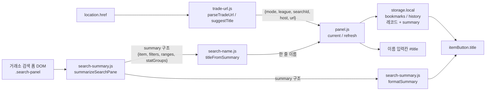

# 모듈 상세 설계 1편 — 검색 판독·북마크

이 편은 거래소 페이지에서 **검색 조건을 읽어 내고**, 그것을 **이름·툴팁·저장 레코드**로 바꾼 뒤 **목록으로 그려 조작하는** 부분의 코드 레벨 설계를 다룹니다. 판독은 `trade-url.js`(주소) 와 `search-summary.js`(폼) 두 갈래이고, 판독 결과는 `search-name.js`를 거쳐 이름이 되며, `panel.js`의 북마크·기록 구역에서 스토리지와 화면으로 갈라집니다.

| 항목 | 내용 |
| --- | --- |
| 담당 파일 | `trade-url.js`, `search-summary.js`, `search-name.js` |
| `panel.js` 담당 줄 | `:246`~`:716` (북마크 `:246`~`:361`, 검색 기록 `:362`~`:478`, 폼 채우기·감시·저장·`storage.onChanged` `:479`~`:716`) |
| 계약 테스트 | `test/search-summary.test.js` |
| 요구사항 | [`../REQUIREMENT.md`](../REQUIREMENT.md) §3.2 북마크(FR-BM) · §3.3 검색 기록(FR-HIST) · §3.4 판독·요약·기본 이름(FR-SUM) |

**경계에 걸친 항목** — 목록 항목의 단추 동작(정규식 복사·삭제·이동)은 그리는 방식이 3편의 렌더 정책을 따르더라도 **이 편 소관**입니다(§6). 기록 절의 접기는 기록 기능의 일부이므로 이 편, 빌더 절의 접기는 2편, 사이드바 자체의 여닫기는 3편입니다.

**함께 읽을 문서** — 상위 설계는 [`../DESIGN.md`](../DESIGN.md), 선택의 배경은 [`adr.md`](adr.md), 나머지 상세는 [2편 정규식 엔진·8모드 빌더](detail-mapfilter.md)와 [3편 사이드바 셸·EN 복사](detail-ui.md)입니다.

---

## 1. 모듈 지도

콘텐츠 스크립트끼리는 `require`하지 않습니다. `manifest.json`의 `js` 배열(`manifest.json:28`~`:38`) 순서대로 `<script>`가 실행되고 전역을 나눠 씁니다(`trade-url.js` → `search-summary.js` → `search-name.js` → … → `panel.js`). 그래서 의존은 **선언이 아니라 로드 순서**로 지켜집니다(→ `../DESIGN.md` §4).

핵심은 **요약 구조가 저장 형식이고, 문구는 그릴 때 만든다**는 점입니다(FR-SUM-10). 저장된 것은 `formatSummary`의 결과가 아니라 `summarizeSearchPane`의 반환 구조이고(`panel.js:437`, `panel.js:664`), 툴팁 문구는 목록을 그릴 때마다 새로 만듭니다(`panel.js:300`). 표기 규칙을 바꾸면 예전 항목에도 그대로 적용됩니다.

---

## 2. `trade-url.js` — 주소 판독과 정규화

### 2.1 지원 형태와 세그먼트 해석

`parseTradeUrl`(`trade-url.js:31`)은 문자열을 `new URL`로 파싱하고 실패하면 `null`을 돌려줍니다(`trade-url.js:34`). 경로는 빈 조각을 걸러 배열로 만든 뒤 `trade` 세그먼트를 기준점으로 삼습니다(`trade-url.js:41`). 즉 **경로 앞에 무엇이 붙든 상관하지 않습니다** — 로케일 세그먼트(`/kr/trade/...`)는 `trade`보다 앞에 있으므로 자연히 무시됩니다.

`trade` 다음 한 칸은 모드이며 `search`와 `exchange`만 통과합니다(`trade-url.js:46`). 남은 조각은 길이로 갈라 읽습니다 — 0개면 거래소 첫 화면이라 `null`(`trade-url.js:50`), 1개면 `league`만 두고 `searchId`는 `null`(`trade-url.js:55`), 2개 이상이면 뒤에서 두 번째가 `league`, 마지막이 `searchId`입니다(`trade-url.js:57`).

뒤에서 세는 방식을 택한 덕분에 `trade/search/<locale>/<league>/<id>`처럼 중간에 조각이 끼어도 같은 코드로 읽힙니다. 앞에서 세면 로케일 유무마다 분기가 필요합니다.

### 2.2 정규화 규칙

반환 `url`은 `origin + pathname`이고 끝 슬래시 하나를 지웁니다(`trade-url.js:67`). **쿼리스트링과 해시는 버립니다** — 거래소의 검색 조건은 검색 ID에 묶여 서버가 갖고 있으므로 주소 뒤 파라미터는 결과를 바꾸지 않습니다. 이 정규화가 곧 **동일성 판정 키**입니다. 북마크 조회(`panel.js:588`), 기록 병합(`panel.js:428`), 이동 표식 대조(`panel.js:407`), 재렌더 생략(`panel.js:609`)이 모두 이 `url` 문자열 비교 하나에 기댑니다.

`league`는 `decodeURIComponent`로 풀어 표시에 씁니다(`trade-url.js:63`). 반면 `url`은 원본 인코딩을 그대로 둡니다 — 키로 쓰이므로 왕복 변환으로 흔들리면 안 됩니다. `searchId`는 디코딩하지 않습니다(거래소 ID는 영숫자).

### 2.3 PoE2 배제, 호스트 목록, 최후의 이름

PoE2는 경로가 `/trade2/`라 `parts.indexOf('trade')`가 `-1`이 되어 자동으로 걸러집니다(`trade-url.js:43`). 별도 부정 조건이 없다는 점이 중요합니다 — 배제가 **판정 기준의 부산물**이라 규칙이 하나뿐입니다.

`TRADE_HOSTS`(`trade-url.js:16`)는 공식 도메인 2종, 한국 서버 2종, 로케일 서브도메인 8종을 열거합니다. 이 목록은 `manifest.json`의 `content_scripts.matches`(`manifest.json:14`)와 짝을 이뤄야 합니다. matches는 와일드카드(`https://*.pathofexile.com/trade/*`)라 넓고 `TRADE_HOSTS`는 열거라 좁으므로 **실질 상한은 항상 `TRADE_HOSTS`**입니다. 새 로케일 서브도메인이 생기면 스크립트는 주입되지만 `parseTradeUrl`이 `null`을 돌려주어 "거래소 검색 페이지에서 저장할 수 있습니다"만 보이게 됩니다 — 조용한 오작동이 아니라 눈에 보이는 실패라 추적이 쉽습니다.

`suggestTitle`(`trade-url.js:71`)은 폼을 못 읽었을 때의 최후 이름이며, 모양은 `<리그> <검색|대량거래> <검색ID>`입니다. 모드 라벨은 `exchange`면 `대량거래`, 아니면 `검색`으로 갈리고(`trade-url.js:73`), 검색 ID가 없으면 `<리그> <검색|대량거래>`까지만 씁니다(`trade-url.js:76`). 이 함수를 쓰는 곳은 셋 — 폼 초기값(`panel.js:599`), 기록 제목의 폴백(`panel.js:431`), 저장 시 빈 이름 대체(`panel.js:635`)입니다. 같은 라벨 규칙이 목록 메타에도 필요해 `panel.js:286`에 `modeLabel`이 따로 있습니다(§6.2).

---

## 3. `search-summary.js` — 폼 판독

### 3.1 설계 원칙: 선택자를 한 파일에 가둔다

거래소 폼은 vue-multiselect를 쓰고, **같은 컴포넌트라도 값이 들어 있는 자리가 문맥마다 다릅니다**(`search-summary.js:7`~`:13`). 이 사실 자체는 바꿀 수 없으므로, 설계는 "어디를 읽는가"를 한 파일에 모아 **변경 파급을 차단**하는 쪽을 택했습니다. 파일 머리에 선택자 상수 4개만 두고(`search-summary.js:22`~`:25`), 나머지는 그 아래 함수에서만 씁니다.

| 상수 | 값 | 역할 |
| --- | --- | --- |
| `SEARCH_PANE` | `.search-panel` | 판독 진입점. 없으면 `null`을 돌려주고 호출부가 주소 기반 이름으로 물러난다 |
| `SEARCH_BOX` | `.search-left .search-select` | 검색창(아이템). 좌측 열에 한정해 다른 select와 섞이지 않게 한다 |
| `STAT_PANE` | `.search-advanced-pane.brown` | 능력치 영역. 일반 필터 수집에서 제외하는 경계로도 쓴다 |
| `PICKED_FILTER` | `.multiselect.filter-select.modified` | 사용자가 고른 드롭다운. `modified`는 거래소가 직접 붙이므로 "건드린 칸"을 우리가 판정할 필요가 없다 |

`PICKED_FILTER`가 `.filter-select`를 요구하는 덕분에 상단 리그·상태 드롭다운(`.status-select`)이 자연히 빠집니다(`search-summary.js:15`). 이것도 부정 조건이 아니라 **클래스 차이를 그대로 이용한 배제**입니다.

### 3.2 자리별 판독 함수

- **`rowTitle`**(`search-summary.js:36`) — `.filter-title`의 자식 노드를 순회하며 `.mutate-type` 요소(`유사`, `비고정` 같은 스탯 종류 딱지)를 `type`으로, 나머지 텍스트를 `label`로 나눕니다. `textContent`를 통째로 쓰면 딱지가 라벨에 섞여 이름이 지저분해지고, 딱지만 버리면 요약이 뜻을 잃습니다. **나눠 두면 소비자가 각자 고를 수 있습니다** — 이름은 `label`만 쓰고(`search-name.js:25`), 요약은 `(유사) 힘 총 #`처럼 앞에 붙입니다(`search-summary.js:151`).
- **`rowRange`**(`search-summary.js:51`) — `input.minmax` 두 개를 순서대로 `min`/`max`에 담습니다. 한쪽만 채우는 경우가 대부분이라 합치지 않고 그대로 나눠 두고, 표기 결정은 뒤로 미룹니다.
- **`pickedValue`**(`search-summary.js:57`) — vue-multiselect는 **고른 라벨을 안쪽 `input`의 `placeholder`로 넣습니다**. `value`가 아니라 `placeholder`를 읽는 이 한 줄이 이 파일에서 가장 비직관적인 지점이고, 그래서 함수로 이름을 붙여 놨습니다.
- **`searchBoxItem`**(`search-summary.js:63`) — 검색창은 상태가 넷이라 4단 폴백을 씁니다. ① `.multiselect__tag` 전부(고른 아이템, 여럿이면 `, `로 잇는다, `:68`) → ② `.multiselect__single`(단일 선택 표시, `:72`) → ③ `.multiselect__input.value`(타이핑만 하고 아직 안 고름, `:77`) → ④ `.multiselect__input.placeholder`(컨테이너에 `modified`가 있을 때만, `:81`).

4순위에 `modified` 조건을 단 이유는 **빈 검색창의 안내 문구가 이름으로 새어 들어오는 것**을 막기 위해서입니다. 조건 없는 검색이 안내 문구를 제 이름으로 갖게 되기 때문입니다. 진입 시 `SEARCH_BOX`가 없으면 `.search-select`로 한 번 더 완화해 찾습니다(`search-summary.js:64`) — 레이아웃 클래스(`.search-left`)가 바뀌어도 판독이 통째로 죽지는 않게 하는 완충입니다.

### 3.3 수집 규칙

`summarizeSearchPane`(`search-summary.js:97`)은 세 덩어리를 각각 다른 기준으로 모읍니다.

1. **filters** — `PICKED_FILTER` 전부에서 `STAT_PANE` 안쪽을 뺍니다(`search-summary.js:104`). 능력치 행의 값 드롭다운은 그 행과 함께 다뤄야 뜻이 살기 때문입니다. 값(placeholder)이 비면 버립니다.
2. **ranges** — `.filter` 중 `input.minmax.modified`를 가진 행만 담습니다(`search-summary.js:115`). 여기서도 `modified` 판정을 거래소에 맡기고, 역시 `STAT_PANE` 안쪽은 제외합니다.
3. **statGroups** — `STAT_PANE` 안의 `.filter-group`마다 `.filter-group-body > .filter` 중 `.filter-title`이 있는 행만 모읍니다(`search-summary.js:123`). 제목 없는 행은 '+ 능력치 필터 추가' 자리이므로 이 조건 하나로 걸러집니다. 행이 하나도 없는 그룹은 통째로 버리고(`search-summary.js:126`), 그룹 제목은 헤더의 `.filter-group-header`에서 `rowTitle`로 읽습니다(`search-summary.js:127`).

능력치 행은 **값이 없어도 남깁니다** — 사용자가 직접 추가해야만 존재하므로 존재 자체가 조건이기 때문입니다(테스트가 이를 고정합니다 — §8). `hasSummary`(`search-summary.js:134`)는 넷 중 하나라도 비어 있지 않은지만 봅니다. 용도가 둘입니다 — 폼이 아직 안 채워졌는지 가리는 재시도 종료 조건(`panel.js:501`)과, 저장 레코드에 `summary` 키를 넣을지 말지의 판정(`panel.js:437`, `panel.js:649`, `panel.js:664`)입니다.

### 3.4 표기와 절단

`summaryValue`(`search-summary.js:142`)가 값 하나의 모양을 정합니다 — 둘 다 있고 같으면 `= n`, 다르면 `n ~ m`, 최소만 `>= n`, 최대만 `<= n`, 아무것도 없으면 드롭다운 값. `summaryRow`(`search-summary.js:150`)가 `(유사) 라벨: 값` 형태로 잇고, 값이 없으면 이름만 남깁니다.

`summaryLines`(`search-summary.js:163`)는 아이템 → 필터 → 범위 → 능력치 그룹 순으로 폅니다. 능력치는 `[모두 일치]`, `[일치 없음]` 같은 **그룹 제목을 반드시 함께 적습니다**(`search-summary.js:173`). 같은 스탯이라도 찾는 조건인지 거르는 조건인지에 따라 뜻이 정반대라, 제목을 빼면 요약이 사실과 반대가 됩니다(FR-SUM-03).

`formatSummary`(`search-summary.js:180`)는 14줄(`SUMMARY_MAX_LINES`, `search-summary.js:28`)까지만 보이고 넘으면 잘라낸 뒤 `…외 N줄`을 덧붙입니다. **감추지 않고 남은 양을 알리는** 쪽을 택한 이유는, 툴팁이 잘렸는지 아닌지 사용자가 알 수 없으면 "조건이 이게 다"라고 오해하기 때문입니다. 한도는 인자로 받아 호출부가 바꿀 수 있게 열어 뒀습니다.

---

## 4. `search-name.js` — 한 줄 이름

이름은 툴팁과 목적이 다릅니다. 툴팁은 **전부 보여 주는 것**이 목적이라 여러 줄을 쓰고 잘린 양을 알립니다. 이름은 **목록에서 한 줄로 구분되는 것**이 목적이라 80자(`NAME_MAX`, `search-name.js:11` — 입력칸 `maxlength="80"`과 같은 값, `panel.js:37`) 안에 들어가야 하고, 잘렸다는 표시조차 자리를 잡아먹습니다. 그래서 규칙이 다릅니다.

**우선순위** — 검색창 아이템이 있으면 그것만 씁니다(`search-name.js:46`). 아이템 이름을 지정한 검색은 그 이름이 곧 정체성이고, 뒤에 필터를 덧붙여 봐야 구분에 기여하지 않기 때문입니다. 이때만 `slice`로 하드 절단합니다.

**조각 만들기** — 아이템이 없으면 조각을 순서대로 쌓습니다(`search-name.js:48`~`:63`).

| 출처 | 조각 | 근거 |
| --- | --- | --- |
| filters | `filter.value`만 (라벨 버림) | `search-name.js:51` |
| ranges | `nameRow` → `라벨 16`, `라벨 8+`, `라벨 ~5`, `라벨 1-3` | `search-name.js:54`, `search-name.js:15` |
| statGroups (행 1개) | 그 행의 `nameRow` | `search-name.js:59` |
| statGroups (행 여럿) | `<그룹제목> N개`, 제목이 없으면 `능력치 N개` | `search-name.js:62` |

필터에서 라벨을 버리는 것은 값만으로 이미 뜻이 서기 때문입니다 — `아이템 분류: 지도`보다 `지도`가 짧고 똑같이 읽힙니다. 범위는 반대로 라벨이 없으면 숫자만 남아 무의미하므로 `nameRow`가 라벨 없는 행에 대해 빈 문자열을 돌려줍니다(`search-name.js:23`). 표기도 툴팁과 다릅니다 — `>= 8`이 아니라 `8+`, `100 ~ 200`이 아니라 `100-200`으로 공백을 아낍니다.

**이어 붙이기** — `joinParts`(`search-name.js:29`)는 `new Set`으로 중복을 제거하고(같은 값의 필터가 여러 자리에서 나올 수 있습니다) ` · `로 잇되, **한도를 넘기는 조각을 만나면 `break`합니다**. 건너뛰고 뒤를 이어 붙이지 않습니다. 이유는 두 가지입니다 — (1) 뒤쪽 짧은 조각만 살아남으면 이름이 앞뒤가 안 맞는 파편이 됩니다, (2) 앞에서부터 자르면 결과가 결정적이라 같은 검색이 항상 같은 이름을 얻습니다. 결과적으로 이름은 **조건 목록의 접두사**이고, 그래서 조각을 쌓는 순서(필터 → 범위 → 능력치)가 곧 중요도 순서입니다.

못 읽었으면 `''`을 돌려주고 호출부가 `suggestTitle`로 물러납니다(`search-name.js:45`, `panel.js:431`).

---

## 5. 북마크·기록의 상태 설계

### 5.1 상태 변수와 불변식

| 변수 | 선언 | 뜻 | 불변식 |
| --- | --- | --- | --- |
| `current` | `panel.js:248` | 지금 주소를 파싱한 결과 또는 `null` | `refresh` 진입 때만 갱신된다(`panel.js:606`) |
| `savedBookmark` | `panel.js:249` | 현재 검색이 이미 저장돼 있으면 그 레코드 | `renderForm` 시작에서 `null`(`panel.js:567`), 조회 후 채움(`panel.js:588`), 저장 성공 시 낙관적으로 채움(`panel.js:675`) |
| `renderedUrl` | `panel.js:250` | 폼에 이미 반영한 URL | `refresh`가 `force`가 아니면 이 값과 같을 때 즉시 반환(`panel.js:609`) |
| `rendering` | `panel.js:251` | 폼을 그리는 중 | `refresh`의 `try/finally`로만 켜고 끈다(`panel.js:614`~`:621`) |
| `filledName` | `panel.js:488` | 우리가 채워 둔 추천 이름 | `renderForm`에서 `null`, 채웠을 때만 문자열 |
| `nameTouched` | `panel.js:489` | 사용자가 이름칸을 직접 고쳤는지 | `input` 이벤트에서 `true`(`panel.js:625`), `renderForm`과 `watchSearch`에서 `false` |
| `currentSummary` | `panel.js:379` | 지금 페이지에서 읽어 둔 요약 | `refresh` 진입에서 `null`(`panel.js:611`), 판독 후 대입(`panel.js:516`, `panel.js:547`) |
| `skipNavUrl` | `panel.js:377` | 패널에서 눌러 들어온 주소, 1회용 | `init`에서 한 번 채우고(`panel.js:1294`) 쓰면 즉시 `null`(`panel.js:423`) |

### 5.2 추천 이름을 덮어쓰지 않는 네 가지 보호 조건

`fillFromSearchPane`(`panel.js:511`)은 폼을 읽어 낸 뒤 네 조건이 모두 참일 때만 이름칸에 손을 댑니다(`panel.js:520`).

| 조건 | 막는 것 |
| --- | --- |
| `title`이 비지 않음 | 폼을 못 읽었을 때 `suggestTitle`로 채워 둔 이름을 빈 문자열로 덮는 것 |
| `!nameTouched` | 사용자가 방금 타이핑한 이름을 지우는 것 |
| `!savedBookmark` | 이미 저장된 북마크의 이름을 추천 이름으로 되돌리는 것(그러면 '이름 변경' 버튼이 잠기지 않고 오조작을 부른다) |
| `!(pending && pending.url === parsed.url)` | 8모드 빌더가 지어 준 `16T 8모드 (N개 거름)`을 폼에서 읽은 이름으로 덮는 것 |

네 조건은 **각기 다른 출처의 이름을 지키는 것**이고, 우선순위는 `renderForm`이 이름칸을 채우는 순서(저장된 이름 → 빌더 이름 → `suggestTitle`, `panel.js:589`~`:600`)와 정확히 대응합니다(FR-SUM-09).

### 5.3 `filledName === null`이면 `watchSearch`가 물러나는 이유

`watchSearch`(`panel.js:536`)는 0.5초마다 폼을 다시 읽어 이름이 달라졌으면 갱신합니다(`panel.js:690`). 이때 `filledName === null`이면 즉시 반환합니다(`panel.js:541`).

이 한 줄이 구분하는 것은 **"거래소가 폼을 채우는 중"과 "검색이 바뀜"** 입니다. 둘 다 겉보기에는 '읽히는 이름이 달라졌다'로 나타나지만 뜻이 정반대입니다. 페이지 로드 직후 폼은 비어 있다가 채워지므로 `없음 → 있음` 전이가 반드시 한 번 일어나는데, 이것을 '검색 변경'으로 오인하면 사용자가 미리 적어 둔 이름을 지워 버립니다. 첫 판독은 `fillFromSearchPane`이 네 가지 보호 조건을 걸고 처리하고(§5.2), `watchSearch`는 **한 번이라도 채워진 뒤의 `있음 → 다른 있음` 전이만** 담당합니다. 이 분업 덕분에 `watchSearch`는 `nameTouched`를 무시하고 덮어쓸 수 있습니다(`panel.js:550`) — 그 시점의 변화는 확실히 검색 변경이기 때문입니다(FR-SUM-09의 단서 조항). 같은 이유로 `watchSearch`는 읽어 낸 이름이 비었으면 아무것도 하지 않습니다(`panel.js:545`) — 검색 중 폼이 잠시 비는 순간에 이름을 날리지 않기 위해서입니다.

### 5.4 두 개의 가드와 두 개의 감시 축

`refresh`는 `renderForm` → `fillFromSearchPane`을 `await`하고, 후자는 최대 8회 × 0.25초, 곧 **2초까지 기다릴 수 있습니다**(`panel.js:483`~`:484`, `panel.js:496`). 그동안 0.5초 타이머는 계속 돌아 `watchSearch`를 서너 번 부릅니다. 그래서 가드가 둘입니다 — `rendering`은 그 구간 전체를 `try/finally`로 감싸(`panel.js:614`) **다른 종류의 작업(감시)** 이 끼어드는 것을 막고, `renderedUrl`은 `await` 전에 먼저 대입해(`panel.js:610`) **같은 작업의 반복**을 막습니다. `rendering`이 없으면 `watchSearch`가 절반쯤 채워진 폼으로 이름을 확정하고 뒤늦게 `fillFromSearchPane`이 다른 값을 덮습니다.

감시 축도 둘입니다. 거래소는 조건이 같으면 같은 검색 ID를 돌려주므로, 뒤집으면 조건을 바꿔 다시 검색해도 **주소가 그대로일 수 있습니다**(`panel.js:532` 주석). URL 비교로 조기 반환하는 구조(`panel.js:609`)만 있으면 그 순간의 추천을 놓치므로, **URL 변화는 `watchUrl`(`panel.js:683`)이, 폼 내용 변화는 `watchSearch`가** 봅니다. 둘은 같은 0.5초 타이머에서 순서대로 돌고(`panel.js:690`~`:693`), `watchSearch`는 폼 전체가 아니라 `titleFromSummary`의 결과 한 줄로 변화를 판정합니다(`panel.js:545`) — 이름이 바뀌지 않는 미세한 조건 변경은 화면에도 나타날 필요가 없기 때문입니다(다만 그 경우 `currentSummary`도 갱신되지 않습니다 — 말미의 "확인이 필요한 자리"). SPA라 `popstate`/`hashchange`만으로는 주소 변경이 다 잡히지 않아 폴링을 함께 씁니다(`panel.js:681` 주석).

### 5.5 레코드 조립 규칙

**북마크 추가**(`panel.js:655`) — `id`는 새로 만들고, `title`/`url`/`league`/`mode`/`searchId`/`createdAt`은 항상 넣습니다. `summary`와 `regex`는 **옵셔널 전개**로 붙입니다(`panel.js:664`, `panel.js:666`). `...(조건 ? {키: 값} : {})` 형태라, 조건이 거짓이면 키 자체가 생기지 않습니다. `summary: null`을 넣는 것과 다릅니다 — 없는 것과 "읽어 봤는데 없더라"를 구분할 필요가 없고, 저장 용량과 툴팁 폴백(`panel.js:300`의 `||`)과 목록의 정규식 버튼 조건(`panel.js:333`)이 모두 단순해집니다.

**이름 변경**(`panel.js:644`) — 기존 레코드를 전개해 `id`와 `createdAt`을 유지하고 `title`/`updatedAt`만 바꿉니다. 같은 URL은 같은 북마크라는 규칙(FR-BM-03)이 여기서 지켜집니다. 이때 `currentSummary`가 있으면 함께 덮어써(`panel.js:649`) 요약이 붙기 전 저장한 북마크를 보강합니다(FR-BM-10).

**기록**(`panel.js:429`) — 같은 URL의 기존 항목이 있으면 **`id`를 물려받습니다**(`panel.js:430`). 삭제 버튼이 `id`로 항목을 지우므로(`panel.js:461`), id가 바뀌면 목록을 다시 그리는 사이 다른 항목을 지울 여지가 생깁니다. 시간 필드는 `at` 하나뿐입니다(`panel.js:438`) — 기록은 "마지막으로 검색한 때"만 뜻이 있으므로 `createdAt`/`updatedAt` 두 축을 둘 이유가 없습니다. 저장은 기존 동일 URL을 제거한 뒤 맨 앞에 붙이고 `HISTORY_MAX = 50`으로 자릅니다(`panel.js:441`~`:442`, FR-HIST-03·04).

**패널 이동 표식** — `openRecord`(`panel.js:289`)는 이동 전에 `markPanelNav`로 스토리지에 `{url, at}`을 남깁니다(`panel.js:291`). 이동하면 스크립트가 새로 시작해 메모리가 날아가므로 스토리지를 씁니다. `takePanelNav`(`panel.js:402`)는 **주소가 맞을 때만 소비**하고, 60초(`NAV_TTL_MS`, `panel.js:374`)가 지난 표식은 값을 돌려주지 않으면서 지웁니다(`panel.js:406`~`:408`). 주소가 다르고 신선한 표식은 **남겨 둡니다** — 마침 같이 열린 다른 탭이 남의 표식을 태워 버리지 않게 하기 위해서입니다(FR-HIST-08). 빌더가 만든 검색은 `markPanelNav`를 부르지 않으므로(`panel.js:948`~`:955`, → 2편) 직접 한 검색으로 기록에 쌓입니다(FR-HIST-02).

### 5.6 저장 직후의 상태 동기화

제출 핸들러는 **스토리지에 쓰기 전에** `savedBookmark`를 갱신하고 버튼·상태 문구를 맞춥니다(`panel.js:675`~`:678`). `storage.onChanged` 리스너가 `savedBookmark`의 `id`/`title`과 새 값을 비교해 다를 때만 `renderForm`을 다시 부르기 때문입니다(`panel.js:712`~`:715`). 순서를 뒤집으면 방금 띄운 "북마크를 추가했습니다" 문구가 재렌더로 지워집니다. 목록 갱신은 어차피 `onChanged`가 하므로 제출 핸들러는 목록에 손대지 않습니다 — 다른 탭에서 바뀐 경우와 경로가 하나로 합쳐집니다(FR-BM-09).

---

## 6. 목록 렌더링과 항목 조작

### 6.1 두 목록이 같은 골격을 쓴다

`renderList`(`panel.js:318`)와 `renderHistory`(`panel.js:445`)는 같은 4단 골격입니다 — 컨테이너 비우기, 개수 표시, 빈 상태 토글, 줄 만들기. 그리는 방식(통째로 다시 그리기, `createElement`, `textContent`) 자체의 근거는 3편 §2.8에 있고, 여기서는 두 목록이 무엇을 다르게 하는지만 봅니다.

| 자리 | 북마크 | 기록 |
| --- | --- | --- |
| 비우기 · 개수 · 빈 상태 | `:319`~`:321` | `:446`~`:448` (같은 규칙) |
| 비우기 버튼 | 없음 | `historyClearEl.hidden = length === 0` (`:449`) |
| 줄 부속 | 정규식(조건부) + 삭제 | 삭제 |

개수는 `(N)` 꼴이고 0이면 빈 문자열, 빈 상태 문구는 `hidden = length > 0`으로 토글합니다. 개수를 0일 때 `(0)`으로 쓰지 않고 아예 지우는 것은, 빈 상태 문구가 바로 아래에 뜨므로 같은 사실을 두 번 말하지 않기 위해서입니다. **기록 비우기 버튼은 기록이 있을 때만 존재합니다** — 누를 것이 없는 버튼을 잠가서 보여 주는 대신 감춥니다(FR-HIST-05).

### 6.2 항목 본체와 메타 표기

두 목록은 줄의 본체를 `itemButton`(`panel.js:296`) 하나로 공유합니다. 이 함수가 툴팁(`formatSummary(record.summary) || record.url`, `:300`), 이름 ``, 메타 ``, 클릭 시 `openRecord`를 한 번에 붙이므로, 두 목록의 줄 모양·툴팁 규칙·이동 동작은 **저절로** 같아집니다(FR-BM-05·07, FR-HIST-01). 호출부가 정하는 것은 메타 문자열 하나뿐입니다.

| 목록 | 메타 | 읽는 필드 | 근거 |
| --- | --- | --- | --- |
| 북마크 | `<리그> · <검색\|대량거래> · <날짜>` | `createdAt` | `:329`, `formatDate`(`:268`) |
| 기록 | `<리그> · <검색\|대량거래> · <월-일 시:분>` | `at` | `:453`, `formatTime`(`:277`) |

`formatDate`는 `toLocaleDateString('ko-KR')`에 연·월·일을 두 자리로 주고, `formatTime`은 `toLocaleString`에 월·일·시·분을 줍니다. 기록만 시각까지 적는 이유는 **같은 날 여러 번 쌓이기 때문**이고(FR-HIST-06), 북마크는 하루 안의 순서를 구분할 이유가 없어 날짜에서 끊습니다. 두 함수가 읽는 필드가 다른 것은 §5.5의 시간 필드 설계가 화면에 그대로 드러난 것입니다.

`modeLabel`(`panel.js:286`)은 `exchange`면 `대량거래`, 아니면 `검색`입니다. `suggestTitle`(`trade-url.js:73`)이 같은 규칙을 따로 갖고 있으므로 라벨을 바꾸려면 두 곳을 함께 고쳐야 합니다 — `trade-url.js`는 `panel.js`를 모르는 하위 모듈이라 참조 방향을 뒤집을 수 없어 남겨 둔 중복입니다.

### 6.3 정규식 복사 버튼 (FR-BM-08)

`bookmark.regex`가 있을 때만 붙습니다(`panel.js:333`). 빌더로 만들지 않은 북마크에는 키 자체가 없으므로(§5.5의 옵셔널 전개) 판정이 `if` 한 줄로 끝납니다.

툴팁에는 `인게임 정규식 복사`와 **정규식 전문**을 함께 넣습니다(`:338`). 인게임 한도가 250자라 툴팁 한 칸에 들어가고, 누르기 전에 무엇이 복사될지 확인할 수 있습니다. 누르면 클립보드에 쓰고 라벨을 `복사됨`으로 바꿨다가 1200ms 뒤 되돌립니다(`:340`~`:342`) — 되돌리기 타이머는 이 줄의 클로저에 갇힌 `setTimeout` 하나이고, 목록이 다시 그려지면 버튼 요소째 사라지므로 3편 §4.6이 EN 단추에 쓴 `WeakMap` 같은 관리가 필요 없습니다.

클립보드 거절에 대한 대비는 없습니다. 3편 §4.5의 2단 폴백(`execCommand`)과 다른 선택이며, 사이드바는 사용자가 방금 누른 자리라 문서 포커스를 잃은 상태가 아니라는 전제에 기댑니다.

### 6.4 삭제와 기록 비우기

세 조작 모두 **화면을 만지지 않고 스토리지만 씁니다.** 북마크 삭제는 `getBookmarks()`를 다시 읽어 `id`가 다른 것만 남기고 통째로 저장하고(`panel.js:352`~`:355`), 기록 삭제도 `getHistory()`에 같은 방식을 씁니다(`panel.js:460`~`:462`). 기록 비우기는 `setHistory([])` 한 줄입니다(`panel.js:475`~`:477`).

두 삭제 모두 **그려진 배열이 아니라 저장소에서 다시 읽어** 거릅니다. 목록을 그린 시점과 누른 시점 사이에 다른 탭이 넣은 항목을 덮어쓰지 않기 위해서입니다. 지운 뒤 목록을 다시 그리는 코드는 없습니다 — `storage.onChanged`가 대신 합니다(§6.6). 기록 비우기에는 확인 절차가 없는데, 기록은 사용자가 만든 자료가 아니라 자동으로 쌓인 것이고 다시 검색하면 도로 쌓이기 때문입니다.

### 6.5 기록 절 접기와 기본 펼침 (FR-HIST-07)

토글(`panel.js:469`~`:473`)은 `historyEl.hidden`을 뒤집고, 화살표 글자를 `▼`/`▶`로 맞추고, `HISTORY_OPEN_KEY`에 **펼침 여부**(`!historyEl.hidden`)를 저장합니다. 복원은 `init`이 합니다(`panel.js:1289`~`:1290`).

기본값이 사이드바와 **정반대**라는 점이 설계입니다. 사이드바는 `stored[PANEL_OPEN_KEY] !== true`일 때 접으므로 저장값이 없으면 접힌 채 시작하고(`panel.js:1285`, FR-PANEL-05 — 열려 있으면 거래소 화면을 좁히기 때문), 기록 절은 `stored[HISTORY_OPEN_KEY] === false`일 때만 접으므로 저장값이 없으면 펼친 채 시작합니다(`panel.js:1289`) — 손대지 않아도 쌓이는 목록이라 보여야 쓸모가 있기 때문입니다. 두 줄의 비교 연산자 차이가 그대로 기본값의 차이입니다. 같은 접기 장치를 쓰는 빌더 절은 저장 위치도 다르고(`BUILDER_KEY.open`) 기본이 접힘이며, 2편에서 다룹니다.

### 6.6 `setStatus`와 `storage.onChanged`

`setStatus`(`panel.js:262`)는 문구·클래스·`hidden`을 한 번에 맞추는 세 줄짜리 함수입니다. 빈 문자열을 주면 `hidden`이 켜져 자리를 차지하지 않으므로, 호출부는 "지우기"를 위한 별도 함수를 알 필요가 없습니다. `kind`는 `null`/`'ok'`/`'error'` 셋이고 클래스 이름으로 그대로 나갑니다(3편 §3.2). 빌더 쪽에 같은 모양의 `setBuilderStatus`가 따로 있는 이유는 2편에서 다룹니다.

`storage.onChanged`(`panel.js:696`)는 **화면 갱신의 유일한 통로**입니다. 목록을 직접 그리는 곳은 `init`(`panel.js:1295`~`:1296`)뿐이고, 그 뒤로는 쓰는 쪽이 스토리지만 건드리면 리스너가 화면을 맞춥니다. 같은 탭의 변경도 이 이벤트를 받으므로 **내 탭과 남의 탭의 경로가 하나**입니다(FR-BM-09).

| 변경 키 | 하는 일 | 줄 |
| --- | --- | --- |
| `history` | `renderHistory(newValue ?? [])` | `:699` |
| `userPresets` | 전역을 갱신하고 프리셋 드롭다운을 다시 그린다(→ 2편) | `:702`~`:705` |
| `bookmarks` | `renderList` 뒤 폼 동기화까지 판정 | `:707`~`:715` |

**기록 분기가 가장 앞이고 가장 짧습니다.** 기록은 저장 폼과 아무 관계가 없어 목록만 다시 그리면 끝나기 때문입니다. 반면 북마크 분기는 지금 보고 있는 검색이 저장돼 있는지에 폼 상태가 걸려 있어, 목록을 그린 뒤 `current.url`로 레코드를 찾아 `savedBookmark`의 `id`/`title`과 견주고 다를 때만 `renderForm()`을 부릅니다(`:712`~`:715`). 세 번째 분기 앞의 조기 반환(`:707`)이 이 둘을 갈라 놓아, **기록만 바뀐 변경은 작성 중인 이름을 건드리지 않습니다.**

---

## 7. DOM 계약과 취약점

거래소는 우리와 계약한 적이 없으므로, 아래는 전부 **관찰에 기댄 의존**입니다. 무너져도 확장이 죽지는 않고 이름·요약이 비는 쪽으로 퇴화합니다.

| 의존하는 DOM | 쓰는 곳 | 바뀌면 | 고칠 곳 |
| --- | --- | --- | --- |
| `.search-panel` | `search-summary.js:98` | 판독 전체가 `null`. 이름은 `<리그> 검색 <ID>`로, 툴팁은 주소로 퇴화. 기록·북마크는 정상 동작 | `SEARCH_PANE` |
| `.search-left .search-select` | `search-summary.js:64` | `.search-select` 폴백으로 넘어감. 좌우 열 구분이 사라지면 엉뚱한 select를 읽을 수 있다 | `SEARCH_BOX` |
| `.multiselect__tag` / `__single` / `__input` | `search-summary.js:68`, `:72`, `:75` | 검색창 아이템만 비고 필터·능력치는 살아남음. 이름이 조건 나열로 바뀜 | `searchBoxItem` |
| `input`의 `placeholder`에 선택 라벨 | `search-summary.js:59`, `:105` | 고른 드롭다운 값이 전부 빔 → `filters` 소멸, 능력치 행의 `value` 소멸 | `pickedValue`, `summarizeSearchPane` |
| `modified` 클래스 | `search-summary.js:25`, `:81`, `:115` | **가장 위험**. 안 붙으면 조건이 통째로 안 읽히고, 반대로 항상 붙으면 안 건드린 칸까지 이름에 새어 든다 | `PICKED_FILTER`, ranges 수집부 |
| `.filter` / `.filter-title` / `.mutate-type` | `search-summary.js:44`, `:107`, `:113`, `:124` | 라벨 소멸. `filters`는 값만 남고 `ranges`는 이름에서 사라짐. 딱지는 라벨에 섞임 | `rowTitle` |
| `input.minmax` (와 `.modified`) | `search-summary.js:52`, `:115` | 범위 조건 소멸 | `rowRange`, ranges 수집부 |
| `.search-advanced-pane.brown`, `.filter-group` / `-body` / `-header` | `search-summary.js:24`, `:122`, `:123`, `:127` | 그룹 구조 소멸 → 제목이 빠져 **요약이 사실과 반대**가 될 수 있다 | `STAT_PANE`, statGroups 수집부 |
| `.status-select`가 `.filter-select`가 **아님** | `search-summary.js:15` | 리그·상태가 조건으로 섞여 모든 이름 앞에 리그명이 붙음 | `PICKED_FILTER` |

방어 설계로 확인된 것 — (1) 선택자가 `search-summary.js` 상단 4개 상수와 몇몇 함수 안에만 있어 수정 지점이 좁습니다, (2) 모든 판독이 옵셔널 체이닝과 `clean`을 통과해 예외 대신 빈 문자열이 됩니다(`search-summary.js:30`), (3) `readSummary`가 못 읽으면 조용히 `null`을 돌려주고 호출부가 주소 기반 이름으로 물러납니다(`panel.js:495`~`:504`). 주석과 코드가 어긋난 곳도 둘 있습니다. `search-summary.js:11` 주석은 선택자를 `input.form-control.minmax`라고 적지만 실제로는 `input.minmax`입니다(`search-summary.js:52`). `trade-url.js:14` 주석은 호스트 목록을 `manifest.json`의 `host_permissions`와 함께 유지하라고 하지만, 실제로 짝을 이뤄야 하는 것은 `content_scripts.matches`입니다 — `host_permissions`에는 `https://www.pathofexile.com/*` 하나뿐이고(`manifest.json:11`), 그것은 3편 §4.4의 영문 조회에 쓰이는 권한입니다.

---

## 8. 테스트가 고정해 둔 계약

`test/search-summary.test.js`(137줄)는 **DOM 판독을 시험하지 않습니다**. 브라우저가 필요한 부분은 빼고, 읽어 낸 구조에서 문구를 만드는 자리만 고정합니다(`test/search-summary.test.js:6`). 콘텐츠 스크립트가 서로를 `require`하지 않으므로 테스트가 `Object.assign(globalThis, …)`으로 로드 순서를 대신 깔아 줍니다(`test/search-summary.test.js:16`) — 이 줄 자체가 "전역 공유 + manifest 순서 의존"이라는 구조를 계약으로 못 박습니다.

표본은 둘입니다. `NECRO`는 아이템 + 필터 하나 + 능력치 2행(`:21`), `MAP_SEARCH`는 아이템 없이 필터·범위·능력치 그룹 2개(그중 12행)로 한도를 넘기게 만든 것입니다(`:37`).

| 테스트 | 고정하는 계약 |
| --- | --- |
| 요약 줄 순서·표기 (`:59`, `:68`) | 아이템 → 필터 → 능력치, 그룹 제목은 `[…]`, 딱지는 `(유사) ` 접두, 값은 `>= n` / `<= n` / `n ~ m` / `= n` |
| 그룹 제목 (`:83`) | `[모두 일치]`와 `[일치 없음]`이 둘 다 나오고, 제목이 그 그룹 행보다 앞에 온다 |
| 값 없는 능력치 (`:91`) | 값이 없어도 행이 살아남고 이름만 적힌다 |
| 절단·빈 요약 (`:103`, `:112`) | 출력 줄 수는 정확히 `SUMMARY_MAX_LINES + 1`, 마지막 줄이 `…외 N줄`. `null`과 빈 구조도 안전하게 처리 |
| 이름 우선순위·조립 (`:120`, `:124`) | 아이템이 있으면 아이템만. 없으면 `지도 · 지도 등급 16 · # 속성 부여 8+ · 일치 없음 12개` |
| 한도 (`:128`) | 결과 길이가 `NAME_MAX` 이하이고 `null` 입력은 `''` |

여기에 없는 것도 계약의 일부입니다. `summarizeSearchPane`, `rowTitle`, `pickedValue`, `searchBoxItem`은 **테스트가 없습니다** — §7의 DOM 의존은 자동 검사로 잡히지 않고 실제 거래소에서 확인해야 합니다(`../REQUIREMENT.md` §7, `../DESIGN.md` §8). §5의 상태 기계와 §6의 목록 조작도 마찬가지로 테스트가 없습니다.

---

## 확인이 필요한 자리

- **`storage.onChanged` 경로의 `filledName` 재설정** — 다른 탭에서 북마크를 지우거나 이름을 바꾸면 `renderForm`이 직접 호출됩니다(`panel.js:715`). `renderForm`은 `filledName`을 `null`로 되돌리지만(`panel.js:569`) 이 경로에는 `fillFromSearchPane`이 이어지지 않습니다. 그러면 이름칸은 `suggestTitle` 값으로 돌아가고, `watchSearch`는 `filledName === null` 때문에 **주소가 바뀔 때까지 계속 물러납니다**(`panel.js:541`). 의도된 절충인지, `refresh({force: true})`로 바꿔야 하는지 확인이 필요합니다.
- **FR-BM-10의 발동 조건** — 요약 보강은 이름 변경 분기 안에 있고(`panel.js:649`), 그 앞에 `name === existing.title`이면 조기 반환이 있습니다(`panel.js:642`). 버튼도 같은 조건으로 잠깁니다(`panel.js:559`). 즉 **이름을 실제로 바꿔야만** 옛 북마크에 요약이 붙습니다. 요구사항 문구("이름을 다시 저장하면")와 어긋나는지 확인이 필요합니다(→ `../DESIGN.md` §9).
- **`watchSearch`의 `currentSummary` 갱신 누락 구간** — 이름이 그대로인 조건 변경(예: 능력치 행의 값만 조정)에서는 `watchSearch`가 `name === filledName`으로 조기 반환하므로(`panel.js:545`) `currentSummary`가 옛 값으로 남습니다. 그 상태로 저장하면 요약이 실제 조건과 어긋납니다. 허용 범위인지 확인이 필요합니다.
- **`rest.length >= 3`의 로케일 배치** — `trade-url.js:10` 주석은 `/trade/<mode>/` **뒤에** 로케일이 끼는 경우를 상정하지만, 실제 거래소에 그런 주소가 존재하는지 확인하지 못했습니다. 코드는 '뒤에서 두 칸'을 읽어 어느 쪽이든 동작합니다.
- **거래소 실제 DOM** — §7의 선택자는 관찰에 기댄 것이고, 거래소가 마크업을 바꾸면 예고 없이 어긋납니다.
